# Amazon Bedrock LLM Monitor


[](CHANGELOG.md)
[](docs/runbooks/deploy.md)
<a href="#english"></a>
<a href="#korean"></a>

A real-time observability dashboard for Amazon Bedrock, Anthropic CP on AWS and OpenAI GPT on Bedrock LLM channels — speed, throughput, reliability, cost, and output quality.

Amazon Bedrock, Anthropic CP on AWS, OpenAI GPT on Bedrock LLM 채널의 응답 속도·처리량·신뢰성·비용·출력 품질을 실시간으로 모니터링하는 대시보드입니다.

---

<a id="english"></a>

# English

## Overview

Amazon Bedrock LLM Monitor is a production-grade observability platform that continuously probes 55 LLM channels (21 Bedrock, 9 Anthropic CP on AWS, 25 OpenAI GPT on Bedrock) across Bedrock Global / US inference profiles (including Claude Opus 5.5, v2.27.0), Anthropic CP on AWS, and OpenAI GPT via Bedrock Mantle in-region endpoints (Path 4) plus Bedrock Global cross-region profiles for GPT-5.6 and GPT-6 Astra, Sol and Luna and US cross-region profiles for GPT-6 Astra, Sol and Luna (v2.20.0, v2.25.0, v2.27.0). (An OpenAI 1P direct path — Path 5 — exists in code but is dormant/hidden as of v2.19.1.) It surfaces latency (TTFT, total, server), throughput (TPS), output token distribution, stop-reason patterns, multi-channel reliability, 30-day cost projections, and official unit prices synced every 12 hours — all behind a Next.js dashboard with eleven monitoring views.

The system runs on AWS ECS Fargate (CDK-managed, 8 stacks), with EventBridge Scheduler driving 5-minute round-robin workload probes across six prompt categories and a 12-hourly sync of official unit prices. A built-in chatbot (Claude Sonnet 4.6 with four Bedrock tools) lets you query the time-series data conversationally.

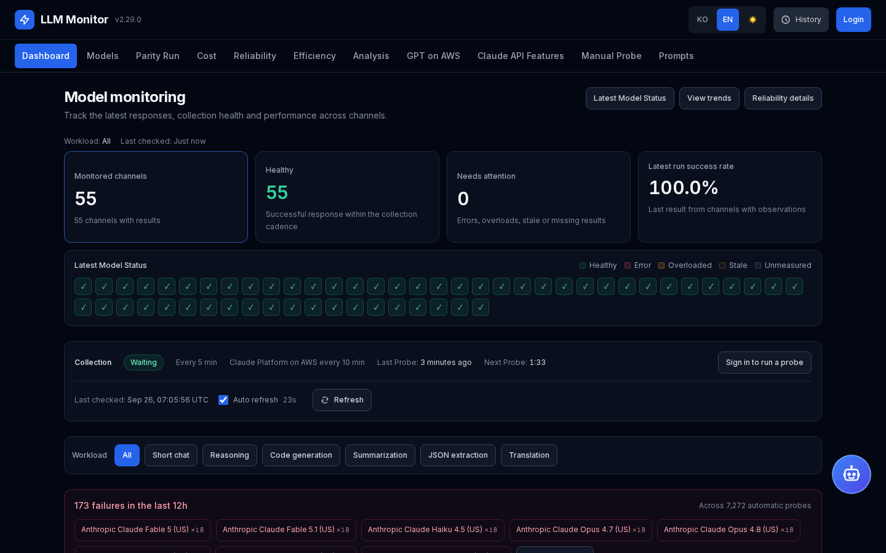

## Features

- **Installable on iPhone/iPad (PWA)** — open the dashboard in Safari, Share → "Add to Home Screen" for a full-screen standalone app (v2.21.0).
- **Real-time auto-probing** — EventBridge Scheduler fires a Fargate task every 5 minutes that round-robins six workload categories (chat-short, reasoning, code-gen, summarize, structured, translate) across all 55 monitored channels. The 9 Claude Platform on AWS channels are probed every cycle with the same category as every other channel (v2.29.1 reverted the v2.29.0 10-minute cadence); setting `ANTHROPIC_CP_PROBE_INTERVAL_S=600` switches them to every other cycle with their own category rotation, an operational lever if the monthly usage cap returns.
- **Eleven analytical pages** — Dashboard (latency / TPS trends), Model Explorer (per-model cards with Converse/InvokeModel/Messages/Responses code examples), Parity Run (model × API-surface × feature evidence matrix), Cost (30-day projection + channel comparison, each probe priced at the unit price in effect at its time), Unit Prices (Standard input/output price per model family and channel with numbered source footnotes and CSV / Markdown / JSON download, v2.30.0), Reliability (success rate per family/channel + error buckets), Efficiency (weighted 0-100 score), Analysis (stop-reason distribution + output-length histograms), Prompts (set CRUD + Bedrock OptimizePrompt), GPT on AWS (18-channel TTFB/TTFT bench over Bedrock Mantle in-region and cross-region profiles — GPT 5.4/5.5/5.6 Terra and GPT-6 Astra/Sol/Luna, 15-min cycles), Claude API Features (documented feature × endpoint × model evidence matrix with doc-drift detection).
- **Unit prices from official sources** — the Unit Prices page (`/pricing`) lists the Standard input and output price per 1M tokens of every active model family across the Claude Platform on AWS, Global, US and In-Region channels. Each price carries a numbered footnote to its source, and the page links the reference list and downloads as CSV, Markdown or JSON. A scheduled PricingSync task reads the Bedrock agreement-offer rate cards, the AWS Price List API and Anthropic's pricing page every 12 hours; a change above 50% on input or output waits for admin approval. Cost and efficiency figures use the price in effect at each probe's time. The page and every download state that the list is reference information compiled from public sources, not an official AWS statement (v2.30.0, ADR-030).
- **Graded model-card metrics** — on the dashboard, each card's TTFT, total latency and TPS value turns blue (normal), amber ▲ (warning) or rose ◆ (critical) against per-workload-category thresholds derived from 48 h of production p90/p99 (TPS is graded only on the low side); a legend expands into the full threshold table, and values carry a `data-grade` attribute and screen-reader descriptions (v2.28.0, ADR-029).
- **12-hourly parity sweep** — a scheduled Fargate task probes every model × API surface × feature cell (6 surfaces × 19 features) with execution evidence (tool-canary round-trip, JSON validity, cached-token counts, stream deltas) — HTTP 200 alone never counts as supported.
- **Daily Claude API Features sweep** — a scheduled Fargate task (daily at 17:30 UTC, 02:30 KST, v2.29.0) runs the 39-row catalog (= 33 documented features + 4 core Messages + Models API 1 + strict_tool_use split 1) against Claude Platform on AWS, Bedrock Mantle `/anthropic`, and Bedrock runtime (Messages API + InvokeModel + Converse) for 5 representative models (Claude Fable 5.1, Fable 5, Opus 5.5, Opus 5, Sonnet 5 — 975 cells per run, v2.28.0), surfacing a documentation-drift banner when observed behavior disagrees with the documented availability.
- **Multi-channel comparison** — Same model family invoked through Bedrock Global, Bedrock US, Anthropic CP on AWS (Path 3 External), and OpenAI GPT via Bedrock Mantle (Path 4) in parallel for true apples-to-apples evaluation.
- **AI chatbot with tools** — Claude Sonnet 4.6 chatbot answers natural-language questions over the time-series store using four custom Bedrock tools; dynamic follow-up suggestions generated per turn.
- **Mobile-responsive UI** — one shared header with a hamburger menu on narrow screens; the same URLs adapt purely by viewport width (v2.16.0).
- **CDK-managed infrastructure** — Eight TypeScript stacks (Network, Data, Cluster, AgentCore, AppServices, Edge, Scheduler, Observability) with reusable L3 constructs, immutable ECR tags, and idempotent lifespan migrations.

## Screenshots

| Dashboard: graded model cards | Dashboard: trend charts |
| --- | --- |
| 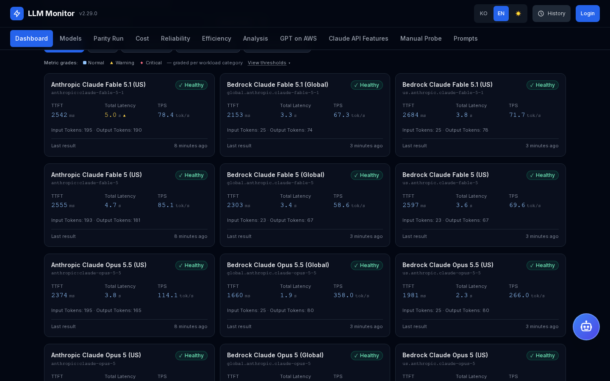 | 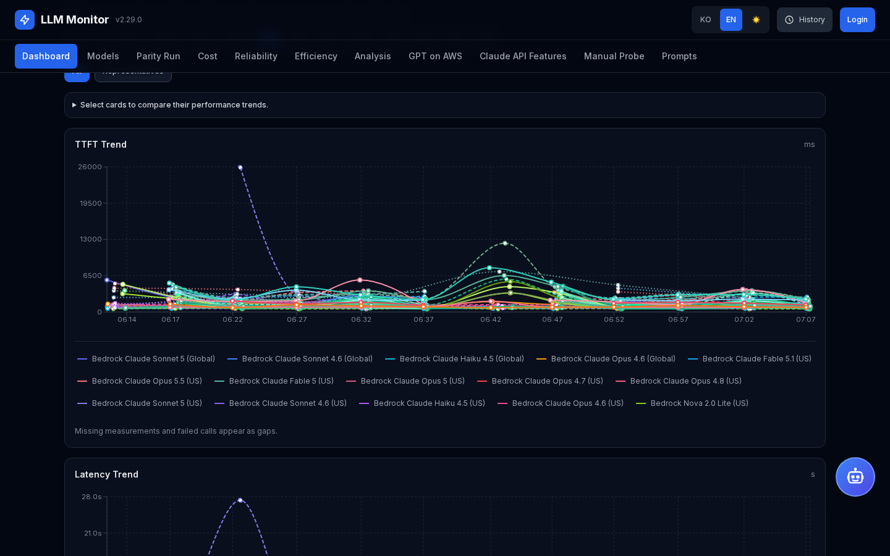 |
| **GPT on AWS** | **Claude API Features** |
| 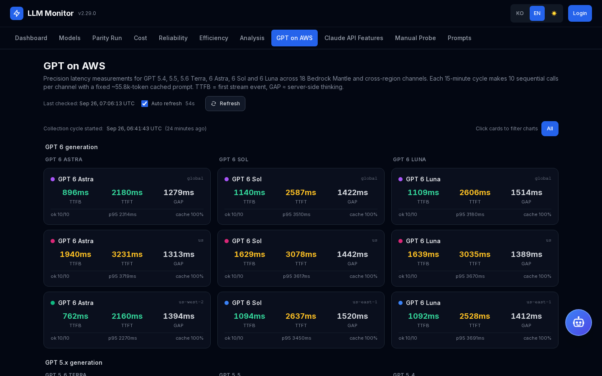 | 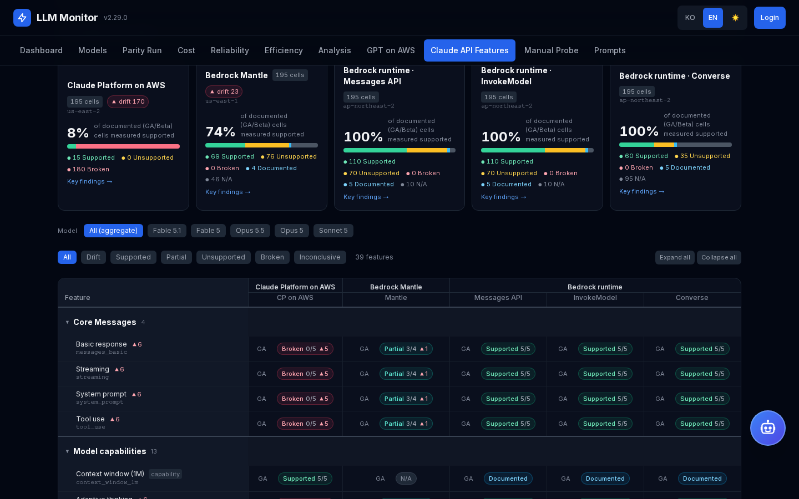 |
| **Parity Run** | **Cost** |
| 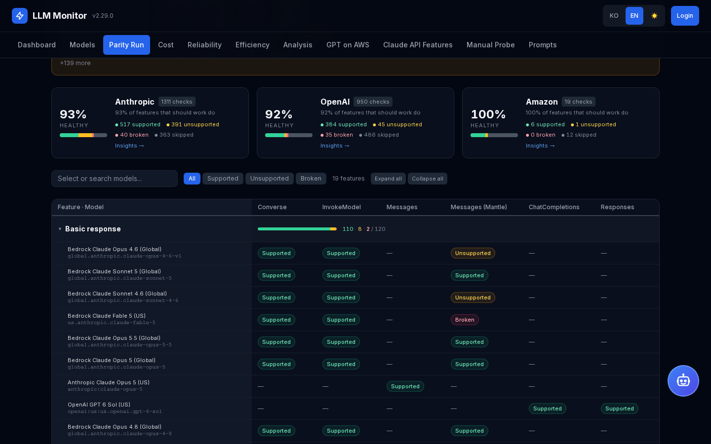 |  |
| **Reliability** |  |
| 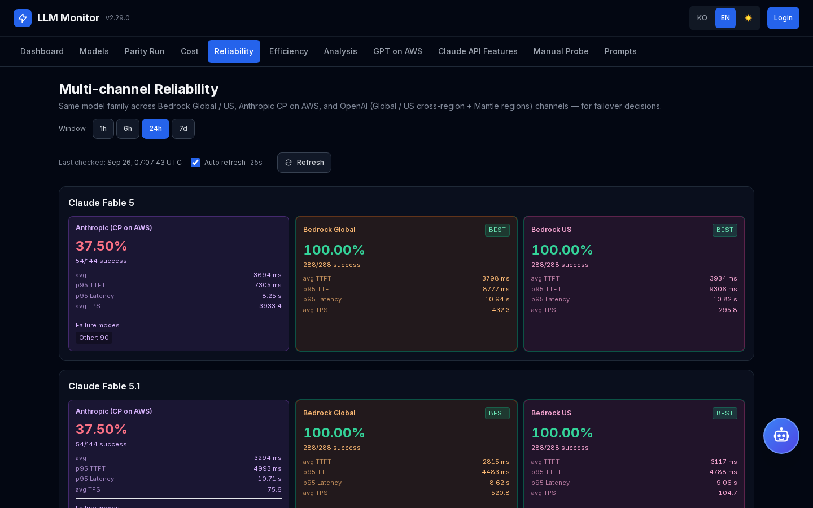 |  |

Captured from production on 2026-09-26 (v2.29.0, dark theme, 1440x900). The Claude Platform on AWS column in Claude API Features and Reliability still reflects the monthly usage-cap 429 period that v2.29.0 stopped retrying, and the dashboard collection line still shows "Claude Platform on AWS every 10 min", which v2.29.1 removed with the return to every-cycle probing. Korean UI captures use the `-ko.png` suffix in the same directory.

## Prerequisites

- AWS account with administrator credentials in `ap-northeast-2` (Seoul)
- Node.js >= 20.9 and npm (CDK)
- Python >= 3.11 (backend)
- Docker (image build for backend and frontend)
- PostgreSQL 16 (local development only)
- ACM certificate for the internal ALB listener (issued in the deploy region)
- ACM certificate in `us-east-1` for the CloudFront alternate domain (`monitorDomain` / `monitorCertArn` context)
- An Anthropic API key + workspace ID for the CP on AWS channel
- An Amazon Bedrock long-term API key for the OpenAI GPT channels

## Installation

```bash
# 1. Clone the repository
git clone https://github.com/whchoi98/model-monitoring.git
cd model-monitoring

# 2. Install dependencies and verify the toolchain
python3 -m pip install -r backend/requirements.txt
(cd frontend && npm ci)
make verify

# 3. Pre-create the SSM SecureString secrets (one-time, manual)
#    The backend service loads all five as ECS secrets and the scheduled tasks all but the
#    admin password, so each must exist before the first deploy
#    AWS_REGION pins the AWS CLI and CDK to the deploy region (CDK takes the stack region from it)
export AWS_REGION=ap-northeast-2
aws ssm put-parameter --name /bedrock-monitor/jwt-secret-key --type SecureString \
  --value "$(openssl rand -base64 48)"
aws ssm put-parameter --name /bedrock-monitor/anthropic-api-key --type SecureString \
  --value "<your Anthropic API key>"
aws ssm put-parameter --name /bedrock-monitor/anthropic-workspace-id --type SecureString \
  --value "<your Anthropic workspace ID>"
aws ssm put-parameter --name /bedrock-monitor/openai-api-key --type SecureString \
  --value "<your Amazon Bedrock long-term API key>"
aws ssm put-parameter --name /bedrock-monitor/seed-admin-password --type SecureString \
  --value "<initial admin password>"

# 4. Create the ECR repositories (one-time)
#    cdk/cdk.json pins this deployment's existingVpcId, appSubnetIds, dataSubnetIds and
#    albCertificateArn in its context: replace them for your account, or remove the three
#    VPC keys to let the Network stack create a new VPC
REGION=ap-northeast-2
ACCT=$(aws sts get-caller-identity --query Account --output text)

#    bedrock-monitor-backend-v2 is not managed by CDK (ADR-018)
aws ecr create-repository --repository-name bedrock-monitor-backend-v2 \
  --image-tag-mutability IMMUTABLE --region $REGION

#    bedrock-monitor-frontend is created by the Cluster stack (CDK also deploys its Network dependency)
(cd cdk && npx cdk bootstrap aws://$ACCT/$REGION && npx cdk deploy BedrockMonitor-Cluster)

# 5. Build and push container images to ECR (immutable tag — never use :latest in production)
TAG="v$(date +%s)"

aws ecr get-login-password --region $REGION \
  | docker login --username AWS --password-stdin $ACCT.dkr.ecr.$REGION.amazonaws.com

docker build --no-cache --pull --platform linux/arm64 -t bedrock-monitor-backend:$TAG backend/
docker tag bedrock-monitor-backend:$TAG \
  $ACCT.dkr.ecr.$REGION.amazonaws.com/bedrock-monitor-backend-v2:$TAG
docker push $ACCT.dkr.ecr.$REGION.amazonaws.com/bedrock-monitor-backend-v2:$TAG

#    RUM build args are optional: empty values build an image with RUM collection disabled
docker build --no-cache --pull --platform linux/arm64 \
  --build-arg NEXT_PUBLIC_RUM_ENDPOINT="$NEXT_PUBLIC_RUM_ENDPOINT" \
  --build-arg NEXT_PUBLIC_RUM_API_KEY="$NEXT_PUBLIC_RUM_API_KEY" \
  -t bedrock-monitor-frontend:$TAG frontend/
docker tag bedrock-monitor-frontend:$TAG \
  $ACCT.dkr.ecr.$REGION.amazonaws.com/bedrock-monitor-frontend:$TAG
docker push $ACCT.dkr.ecr.$REGION.amazonaws.com/bedrock-monitor-frontend:$TAG

#    Pin both images by digest, with the full registry host in the URI
BE_DIGEST=$(aws ecr describe-images --region $REGION --repository-name bedrock-monitor-backend-v2 \
  --image-ids imageTag=$TAG --query 'imageDetails[0].imageDigest' --output text)
FE_DIGEST=$(aws ecr describe-images --region $REGION --repository-name bedrock-monitor-frontend \
  --image-ids imageTag=$TAG --query 'imageDetails[0].imageDigest' --output text)
BACKEND_IMAGE="$ACCT.dkr.ecr.$REGION.amazonaws.com/bedrock-monitor-backend-v2@$BE_DIGEST"
FRONTEND_IMAGE="$ACCT.dkr.ecr.$REGION.amazonaws.com/bedrock-monitor-frontend@$FE_DIGEST"

# 6. Deploy the eight CDK stacks with the pinned images
cd cdk
npx cdk deploy --all \
  -c albCertificateArn="arn:aws:acm:ap-northeast-2:ACCOUNT:certificate/UUID" \
  -c monitorDomain="monitor.example.com" \
  -c monitorCertArn="arn:aws:acm:us-east-1:ACCOUNT:certificate/UUID" \
  -c alarmEmail="ops@example.com" \
  -c backendImage="$BACKEND_IMAGE" \
  -c frontendImage="$FRONTEND_IMAGE"
```

Always pass `-c backendImage` and `-c frontendImage`. Without them, the AppServices and Scheduler stacks synthesize the legacy `:latest` image, and deploying that template rolls the services back to an old image. A URI without the registry host resolves to Docker Hub, and the image pull fails. For later releases, build and push a new tag as in step 5, then deploy only the two stacks that run the images (`--exclusively` leaves their dependency stacks untouched):

```bash
cd cdk
npx cdk deploy --exclusively BedrockMonitor-AppServices BedrockMonitor-Scheduler --require-approval never \
  -c albCertificateArn="arn:aws:acm:ap-northeast-2:ACCOUNT:certificate/UUID" \
  -c backendImage="$BACKEND_IMAGE" \
  -c frontendImage="$FRONTEND_IMAGE"
```

See `docs/runbooks/deploy.md` for the full step-by-step procedure including post-deploy verification.

## Usage

```bash
# Verify the dashboard endpoint
curl https://<your-cloudfront-domain>/api/auto-probe/status
# {"is_running":true,"last_run_time":"...","next_run_time":"...","interval_seconds":300}

# Inspect the latest 55-model probe results
curl https://<your-cloudfront-domain>/api/auto-probe/latest

# Filter by workload category
curl "https://<your-cloudfront-domain>/api/auto-probe/latest?category=code-gen"

# Unit prices (official sources, synced every 12 hours) and a CSV download
curl -s https://<your-cloudfront-domain>/api/pricing | jq '{last_sync, pending_review, families: (.families | length)}'
curl -OJ "https://<your-cloudfront-domain>/api/pricing/export?format=csv&lang=en"

# Authenticate and run a manual probe (SSE stream)
TOKEN=$(curl -sX POST https://<your-cloudfront-domain>/api/auth/login \
  -H 'Content-Type: application/json' \
  -d '{"username":"admin","password":"<your seed password>"}' | jq -r .access_token)

curl -N -H "Authorization: Bearer $TOKEN" \
  -H 'Content-Type: application/json' \
  -X POST https://<your-cloudfront-domain>/api/probes/run \
  -d '{"model_ids":["global.anthropic.claude-haiku-4-5-20251001-v1:0"],"prompt":"hello","max_tokens":50}'
```

## iPhone / iPad App (PWA)

The dashboard installs as a full-screen standalone app on iPhone and iPad — no App Store required (v2.21.0).

**Install**: open the dashboard in Safari → Share → "Add to Home Screen". The installed app keeps its own login session separate from Safari, so sign in once inside the app for authenticated features.

**How it is implemented** (all paths under `frontend/`):

| Piece | File | Notes |
|-------|------|-------|
| Web app manifest | `src/app/manifest.ts` | Served by Next.js at `/manifest.webmanifest` (`display: standalone`, dark theme/background colors) |
| App icons | `src/app/icon.png` (512), `src/app/apple-icon.png` (180), `public/icons/*` | Next.js file conventions auto-inject the icon `<link>` tags; `public/icons` carries the manifest set including Android `maskable` variants (art scaled into the 80% safe zone). Regenerated with a Pillow script (1024 px master → LANCZOS downscale) |
| iOS meta tags | `src/app/layout.tsx` | `metadata.appleWebApp` (capable, black-translucent status bar, app title) + a separate `viewport` export with `viewport-fit=cover` |
| Safe areas | `src/app/globals.css` | Applied only under `@media (display-mode: standalone)`: the sticky header gains `env(safe-area-inset-top)` (notch / Dynamic Island) and the body gains side/bottom insets (home indicator). Regular browser tabs are unaffected |
| Caching | `src/proxy.ts` | The `no-store` matcher excludes the PWA static assets (same treatment as `favicon.ico`) with edge caching configured separately |

A service worker is deliberately **not** used: offline caching would show stale metrics on a real-time dashboard, and iOS home-screen install does not require one.

## Configuration

| Variable | Description | Default |
|----------|-------------|---------|
| `JWT_SECRET_KEY` | JWT signing key (32+ characters; placeholders rejected) | (required, from SSM) |
| `SEED_ADMIN_USERNAME` | Initial admin username for first-boot seeding | `admin` |
| `SEED_ADMIN_PASSWORD` | Initial admin password (8+ characters) | (required, from SSM) |
| `PUBLIC_BASE_URL` | Public base URL used in approval-email links. CDK does not inject it, so set it to your CloudFront domain | (hard-coded fallback in `backend/auth.py`) |
| `DATABASE_URL` | PostgreSQL connection string (built from injected env in CDK) | (CDK-injected) |
| `ANTHROPIC_API_KEY` | Anthropic CP on AWS envelope key (AEAAQ…) | (required, from SSM) |
| `ANTHROPIC_WORKSPACE_ID` | Anthropic CP workspace ID header | (required, from SSM) |
| `ANTHROPIC_AWS_REGION` | CP on AWS endpoint region | `us-east-2` |
| `ANTHROPIC_CP_PROBE_INTERVAL_S` | Collection interval in seconds for the Claude Platform on AWS channels (`anthropic:*`), applied in 5-minute cycle steps (`300` or below = every cycle with the cycle's category, `600` = every other cycle with CP's own category rotation). CDK injects it into the AutoProber task only; when changing it, inject the same value into the backend service, which reports it as `channel_intervals` in `/api/auto-probe/status` | `300` |
| `OPENAI_API_KEY` | Amazon Bedrock long-term API key (bearer) for the OpenAI GPT channels. When unset, every OpenAI channel is skipped | (required, from SSM) |
| `OPENAI_US_EAST_1_BASE_URL` / `OPENAI_US_EAST_2_BASE_URL` / `OPENAI_US_WEST_2_BASE_URL` | Bedrock Mantle OpenAI-compatible endpoint per region (`https://bedrock-mantle.<region>.api.aws/openai/v1`). An unset one skips that region's channels | (CDK-injected) |
| `OPENAI_GLOBAL_BASE_URL` / `OPENAI_US_BASE_URL` | `bedrock-runtime` OpenAI-compatible endpoints for the Global (`global.openai.*`) and US (`us.openai.*`) cross-region profiles, which `bedrock-mantle` does not serve. An unset one skips those channels | `https://bedrock-runtime.ap-northeast-2.amazonaws.com/openai/v1` / `https://bedrock-runtime.us-east-1.amazonaws.com/openai/v1` (CDK-injected) |
| `BEDROCK_OPENAI_*_MODEL_ID` | Mantle in-region model id per GPT family (for example `openai.gpt-6-sol`); the Global and US profile ids are derived with a `global.` / `us.` prefix. An unset one skips that family | (CDK-injected) |
| `PROBE_WALL_CLOCK_S` | Wall-clock cap in seconds for one probe including retries. An expired probe is saved as a `WallClockTimeout` error row and the cycle still completes | `90` |
| `RETENTION_DAYS` | Days of raw `probe_results` to keep. The AutoProber cycle aggregates older rows into `probe_results_hourly`; `0` or less disables it | `60` |
| `MANTLE_ANTHROPIC_REGION` | Region of the Bedrock Mantle `/anthropic` surface used by Claude API Features and the parity run | `us-east-1` (CDK-injected; when unset, Claude API Features uses `us-east-1` and the parity run `ap-northeast-1`) |
| `NEXT_PUBLIC_RUM_ENDPOINT` / `NEXT_PUBLIC_RUM_API_KEY` | Frontend RUM collection, passed as `docker build --build-arg` at build time. When unset, RUM collection is disabled | (unset) |

## Project Structure

```text
model-monitoring/
├── backend/                      # FastAPI + SQLAlchemy + auto-prober
│   ├── main.py                   # entrypoint, lifespan, DB migration with advisory_lock
│   ├── prober.py                 # 55 active (+5 dormant 1P) AVAILABLE_MODELS, retry, Bedrock + Anthropic CP + OpenAI Mantle/Global/US/1P
│   ├── auto_prober.py            # run_cycle() invoked by EventBridge Fargate task
│   ├── gptbench.py               # GPT on AWS bench cycle (18 channels × 10 runs, TTFB/TTFT)
│   ├── pricing_sources.py        # price identity per channel, source maps, disclaimer, reference pages (v2.30.0)
│   ├── pricing_seed.py           # official seed prices for the 55 active channels + ensure_seed
│   ├── pricing_parsers.py        # agreement-offer, Price List and Anthropic pricing.md parsers
│   ├── pricing_sync.py           # 12-hourly sync: fetch, compare, 50% guard, record
│   ├── pricing_sync_runner.py    # PricingSync task entry: python -m pricing_sync_runner --once
│   ├── price_history.py          # effective prices, per-row cost subquery, verification state
│   ├── pricing_payload.py        # /api/pricing payload (order, footnotes, references)
│   ├── pricing_export.py         # CSV, Markdown and JSON export
│   ├── agent/                    # chatbot core: Bedrock model ids, 4 tools, AgentCore Memory, streaming
│   ├── parity/                   # parity run engine: catalog (6 surfaces × 19 features), engine, probes, runner
│   ├── claude_features/          # catalog (39 rows × 5 surfaces × 5 models), transports, probes, engine, runner (v2.23.0)
│   ├── routers/                  # 18 router modules (auth, admin, analysis, cost, pricing, gptbench, features, …)
│   └── tests/                    # pytest suite
├── frontend/                     # Next.js 16 standalone + 12 routes (installable PWA)
│   ├── src/app/                  # /, /models, /parity, /gpt-on-aws, /claude-features, /chat, /prompts, /cost, /pricing, /reliability, /efficiency, /analysis + manifest.ts / PWA icons
│   ├── src/components/           # 30+ React components (dashboard, panels, chat)
│   ├── src/lib/                  # api client, i18n, sortModels, pricingTable, version + vitest unit tests
│   └── e2e/                      # Playwright browser regression specs (fixture APIs)
├── cdk/                          # 8 CDK TypeScript stacks
│   ├── lib/stacks/               # Network, Data, Cluster, AgentCore, AppServices, …
│   └── lib/constructs/           # reusable FargateServiceConstruct (L3) + pinned-image.ts (digest-pinned image context)
├── docs/
│   ├── architecture.md           # full system design
│   ├── api-reference.md          # endpoint reference
│   ├── onboarding.md             # onboarding guide: local setup, key concepts, common tasks
│   ├── decisions/                # ADR-001 through ADR-030
│   ├── images/                   # README screenshots (ui/*-en.png, ui/*-ko.png)
│   └── runbooks/                 # deploy, rollback, troubleshooting
├── CHANGELOG.md                  # Keep a Changelog format (bilingual, repo root)
└── Makefile                      # `make verify` runs CDK/backend checks + frontend types and unit tests
```

## Testing

```bash
# Full verification: CDK lint, typecheck, jest and cdk-nag synth + backend ruff (skipped
# when not installed) and pytest + frontend typecheck and vitest
make verify

# Backend tests only
cd backend && pytest -q

# CDK tests only
cd cdk && npm test

# Frontend unit tests (vitest) and typecheck
cd frontend && npm test && npm run typecheck
```

Browser regression checks (fixture APIs, no paid model calls):

```bash
cd frontend
npm ci
npx playwright install --with-deps chromium webkit
npm run test:e2e
```

The dashboard distinguishes healthy, failed, overloaded, stale and unmeasured channels. Search/status/sort and chart selections are preserved in URLs. Public pages share navigation, login, language preferences and recovery controls. See `docs/reviews/2026-09-22-monitoring-ux.md` for the review and verification record.

## API Documentation

The FastAPI backend exposes auto-generated OpenAPI documentation at:

```text
https://<your-cloudfront-domain>/docs    # Swagger UI
https://<your-cloudfront-domain>/openapi.json
```

Key endpoint groups:

| Group | Path prefix | Authentication |
|-------|-------------|----------------|
| Auth | `/api/auth/*` | login/register public, `/me` requires JWT |
| Auto-probe | `/api/auto-probe/*` | public reads; trigger requires JWT |
| Results | `/api/results/*` | public |
| Models | `/api/models` | public |
| Manual probe | `/api/probes/run` | JWT required |
| Comparison Lab | `/api/compare/run` | JWT required |
| Prompts | `/api/prompts/*` | list public; create, delete and optimize require JWT |
| Cost / Reliability / Efficiency / Analysis | `/api/{cost,reliability,efficiency,analysis}/*` | public |
| Unit Prices | `/api/pricing`, `/api/pricing/export` | public; review approval under `/api/admin/pricing/*` is admin only |
| Parity Run | `/api/parity/*` | public reads; trigger requires JWT |
| Claude API Features | `/api/features/*` | public reads; trigger requires JWT |
| GPT on AWS | `/api/gptbench/*` | public |
| Chat | `/api/chat/*` | JWT required |
| Insights | `/api/insights/*` | regenerate requires JWT |
| Admin | `/api/admin/*` | admin role only |
| Health | `/api/health` | public |

See `docs/api-reference.md` for request and response details of each endpoint.

## Contributing

1. **Fork** the repository on GitHub.
2. Create a **branch** from `main`: `git checkout -b feat/your-feature`.
3. **Commit** with Conventional Commits style: `feat(scope): add X` / `fix(scope): handle Y`.
4. **Push** the branch: `git push origin feat/your-feature`.
5. Open a **Pull Request** against `main` with a summary and test evidence (`make verify` output).

Run `make verify` before pushing. CI (`.github/workflows/ci.yml`) does not call `make verify`; on every push to `main` and every pull request it runs three separate jobs: backend (pytest on Python 3.11), frontend (typecheck, vitest, production build, then Playwright e2e against that build) and cdk (`tsc --noEmit` and jest). ruff, the CDK ESLint check and the cdk-nag `cdk synth` run only in `make verify`.

## License

This project is licensed under the MIT License.

## Contact

- Maintainer: **WooHyung Choi** ([@whchoi98](https://github.com/whchoi98))
- Issues: [github.com/whchoi98/model-monitoring/issues](https://github.com/whchoi98/model-monitoring/issues)
- Email: whchoi98@gmail.com

---

<a id="korean"></a>

# 한국어

## 개요

Amazon Bedrock LLM Monitor는 Bedrock Global / US 추론 프로파일(Claude Opus 5.5 포함, v2.27.0), Anthropic CP on AWS, OpenAI GPT via Bedrock Mantle 인리전 엔드포인트(Path 4)와 GPT-5.6, GPT-6 Astra, Sol, Luna의 Bedrock Global cross-region 프로파일, GPT-6 Astra, Sol, Luna의 US cross-region 프로파일(v2.20.0, v2.25.0, v2.27.0)에 걸친 55개 LLM 채널(Bedrock 21, Anthropic CP on AWS 9, OpenAI GPT on Bedrock 25)을 지속적으로 프로빙하는 운영 등급 관측 플랫폼입니다. (OpenAI 1P direct 경로(Path 5)는 코드에 남아 있지만 v2.19.1부터 휴면·비노출 상태입니다.) 지연(TTFT, 총 응답시간, 서버 처리시간), 처리량(TPS), 출력 토큰 분포, 정지 사유 패턴, 다중 채널 신뢰성, 30일 비용 예측, 12시간마다 갱신되는 공식 단가를 11개 모니터링 화면을 갖춘 Next.js 대시보드에서 제공합니다.

이 시스템은 AWS ECS Fargate (CDK 8개 스택)에서 동작하며, EventBridge Scheduler가 5분마다 6개 프롬프트 카테고리를 라운드로빈하는 워크로드 프로빙을 실행하고, 12시간마다 공식 단가를 동기화합니다. Claude Sonnet 4.6 + 4개 Bedrock 도구로 구성된 챗봇이 시계열 데이터에 대해 자연어 질의를 지원합니다.

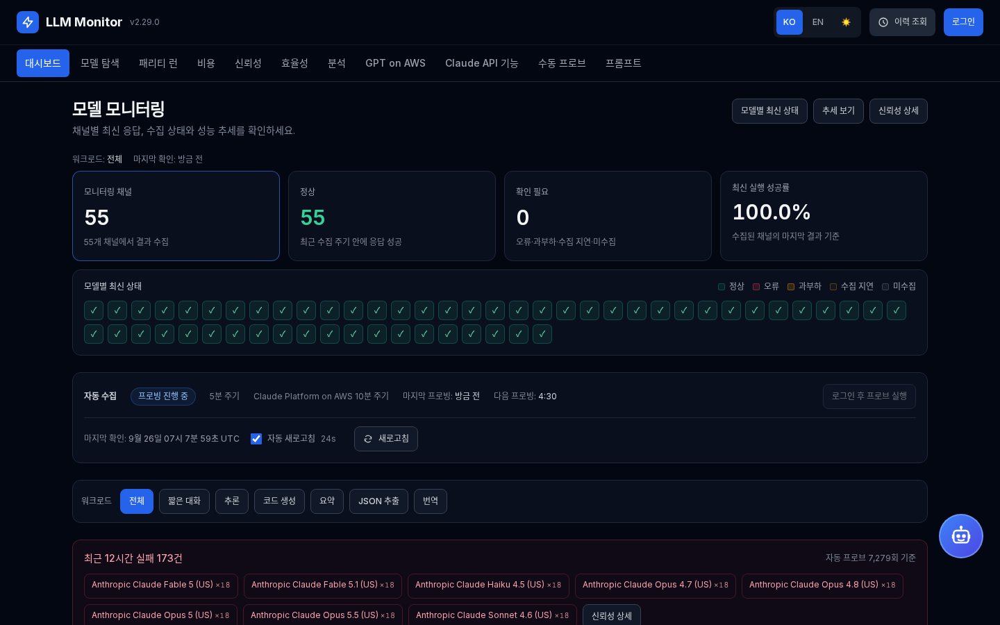

## 주요 기능

- **iPhone/iPad 설치형 앱(PWA)** — Safari에서 대시보드를 열고 공유 → "홈 화면에 추가"하면 전체화면 standalone 앱으로 사용 가능 (v2.21.0).
- **실시간 자동 프로빙** — EventBridge Scheduler가 5분마다 Fargate 태스크를 실행하여 6개 워크로드 카테고리(짧은 대화, 추론, 코드 생성, 요약, JSON 추출, 번역)를 라운드로빈으로 55개 모니터링 채널에 호출합니다. Claude Platform on AWS 9채널도 매 사이클 다른 채널과 같은 카테고리로 호출합니다(v2.29.1에서 v2.29.0의 10분 주기를 되돌렸습니다). `ANTHROPIC_CP_PROBE_INTERVAL_S=600`으로 설정하면 이 채널만 두 사이클에 한 번, 카테고리를 따로 순환하며 호출하므로 월간 사용 한도가 다시 걸릴 때 운영 레버로 쓸 수 있습니다.
- **11개 분석 페이지** — 대시보드(지연/TPS 추이), 모델 탐색(모델별 카드 + Converse/InvokeModel/Messages/Responses 코드 예제), 패리티 런(모델×API surface×피처 증거 매트릭스), 비용(30일 예측 + 채널 비교, 프로브마다 그 시각에 유효했던 단가로 계산), 비용 단가(모델 패밀리와 채널별 Standard 입력/출력 단가, 번호 각주 출처, CSV / Markdown / JSON 다운로드, v2.30.0), 신뢰성(family/channel별 성공률 + 에러 버킷), 효율성(가중 0~100 점수), 분석(정지 사유 분포 + 출력 길이 히스토그램), 프롬프트(세트 CRUD + Bedrock OptimizePrompt), GPT on AWS(Bedrock Mantle 인리전과 교차 리전 프로파일 18채널 TTFB/TTFT 벤치 — GPT 5.4/5.5/5.6 Terra, GPT-6 Astra/Sol/Luna, 15분 주기), Claude API 기능 검증(문서 피처 × 엔드포인트 × 모델 증거 매트릭스 + 문서 드리프트 감지).
- **공식 출처 기반 단가** — 비용 단가 페이지(`/pricing`)가 활성 모델 패밀리마다 Claude Platform on AWS, Global, US, In-Region 채널의 Standard 입력, 출력 단가(1M 토큰당)를 보여 줍니다. 단가마다 번호 각주로 출처를 달고, 참고 자료 목록과 CSV, Markdown, JSON 다운로드를 제공합니다. 스케줄된 PricingSync 태스크가 12시간마다 Bedrock agreement offer rate card, AWS Price List API, Anthropic 요금 문서를 읽고, 입력이나 출력이 50%를 넘게 바뀌면 관리자 승인을 기다립니다. 비용과 효율성 수치는 각 프로브 시각에 유효했던 단가로 계산합니다. 화면과 모든 다운로드 파일에 공개 자료를 모은 참고용 정보이며 AWS 공식 입장이 아니라는 안내를 표시합니다 (v2.30.0, ADR-030).
- **모델 카드 지표 등급** — 대시보드 카드의 TTFT, 총 응답시간, TPS 값을 운영 48시간 p90/p99로 정한 워크로드 카테고리별 기준에 따라 파랑(양호), 호박 ▲(경고), 장미 ◆(위험)으로 표시합니다(TPS는 낮은 쪽만 판정). 범례를 펼치면 전체 기준표가 나오고, 값마다 `data-grade` 속성과 스크린 리더 설명이 붙습니다 (v2.28.0, ADR-029).
- **12시간 주기 패리티 스윕** — 스케줄된 Fargate 태스크가 모델 × API surface × 피처 셀 전체(6 surface × 19 피처)를 실행 증거(도구 카나리 왕복, JSON 유효성, 캐시 토큰 카운트, 스트림 델타)로 검증합니다 — HTTP 200만으로는 지원으로 판정하지 않습니다.
- **일일 Claude API 기능 검증 스윕** — 스케줄된 Fargate 태스크(매일 17:30 UTC, 02:30 KST, v2.29.0)가 39행 카탈로그(= 문서 피처 33 + 코어 4 + Models API 1 + strict_tool_use 분할 1)를 Claude Platform on AWS · Bedrock Mantle `/anthropic` · Bedrock runtime(Messages API + InvokeModel + Converse)에서 대표 모델 5종(Claude Fable 5.1, Fable 5, Opus 5.5, Opus 5, Sonnet 5 — 런당 975셀, v2.28.0)으로 실행하고, 실측이 문서상 가용성과 어긋나면 문서 드리프트 배너로 표시합니다.
- **다중 채널 비교** — 동일 모델 family를 Bedrock Global, Bedrock US, Anthropic CP on AWS (Path 3 External), OpenAI GPT via Bedrock Mantle (Path 4) 네 채널로 병렬 호출하여 정확한 동일 조건 비교를 제공합니다.
- **AI 챗봇 + 도구** — Claude Sonnet 4.6 챗봇이 4개의 Bedrock 커스텀 도구를 사용해 시계열 데이터에 대한 자연어 질의에 응답하며, 매 턴마다 동적 후속 질문을 생성합니다.
- **모바일 반응형 UI** — 공용 헤더 + 좁은 화면 햄버거 메뉴, 같은 URL이 뷰포트 폭만으로 적응 (v2.16.0).
- **CDK 기반 인프라** — TypeScript로 작성된 8개 스택(Network, Data, Cluster, AgentCore, AppServices, Edge, Scheduler, Observability)과 재사용 가능한 L3 construct, 불변 ECR tag, 멱등 lifespan 마이그레이션을 제공합니다.

## 스크린샷

| 대시보드: 지표 등급 모델 카드 | 대시보드: 추이 차트 |
| --- | --- |
| 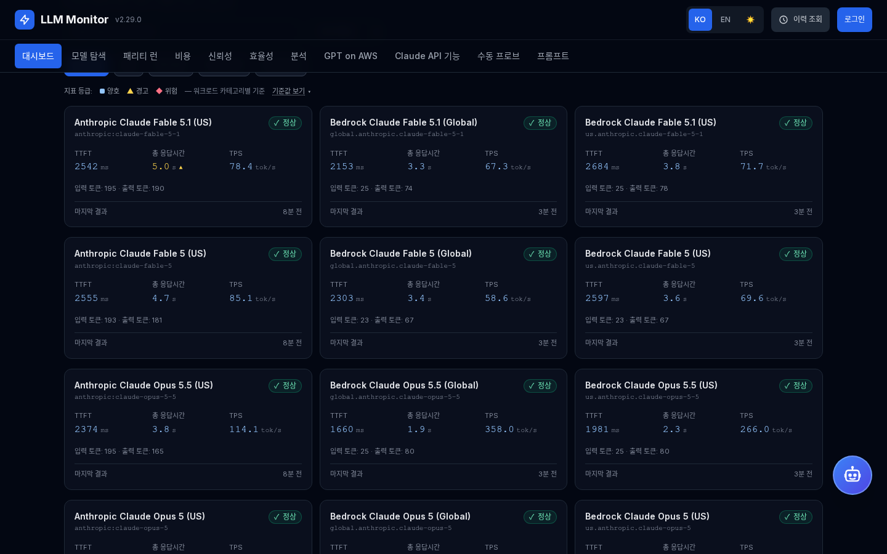 | 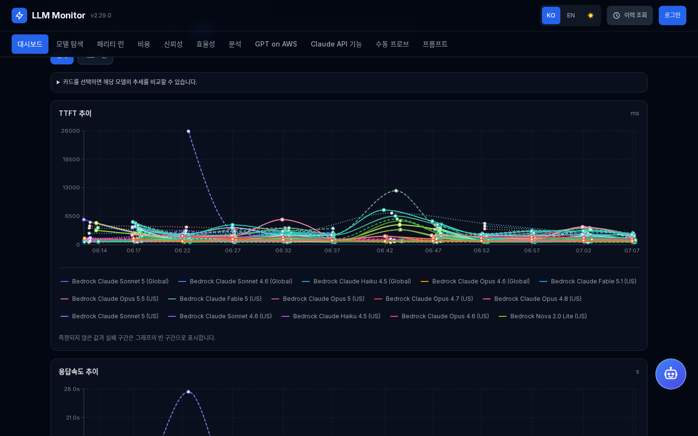 |
| **GPT on AWS** | **Claude API 기능** |
| 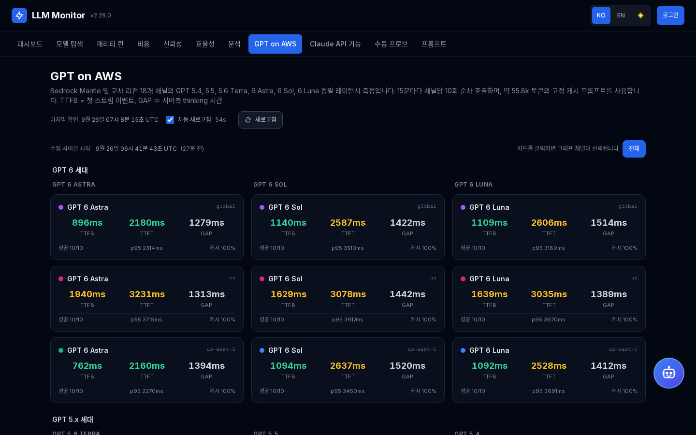 | 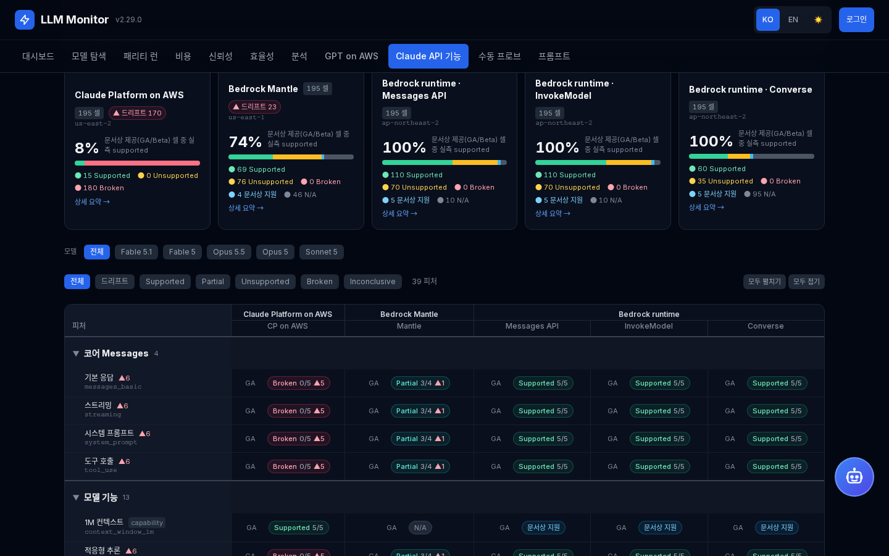 |
| **패리티 런** | **비용** |
| 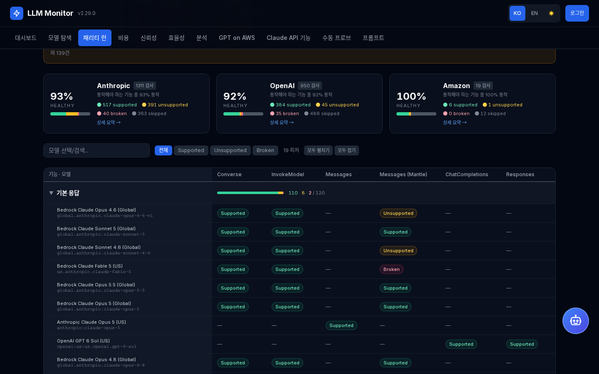 | 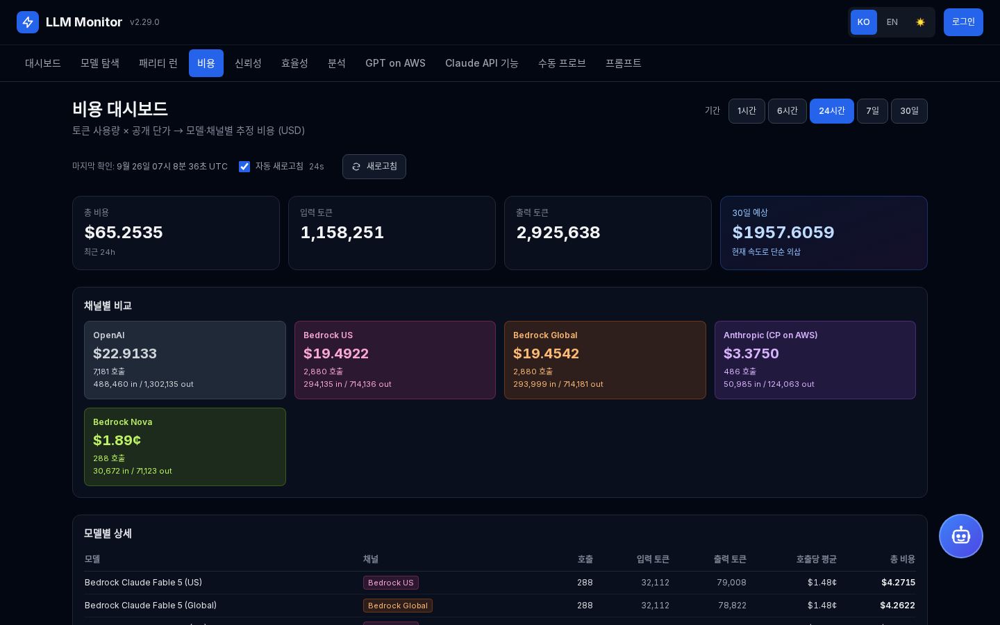 |
| **신뢰성** |  |
| 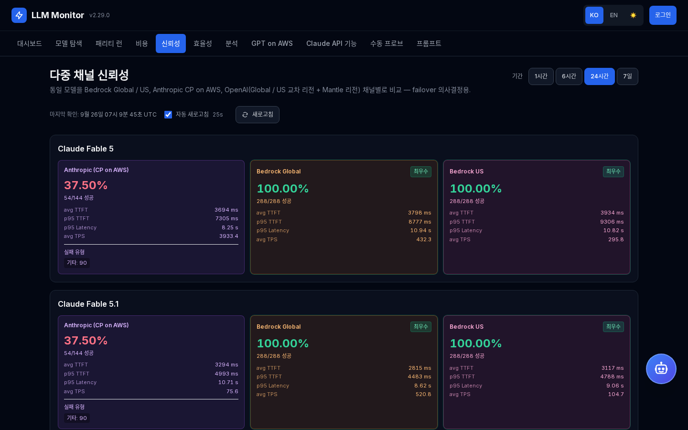 |  |

2026-09-26 운영 환경에서 캡처했습니다(v2.29.0, 다크 테마, 1440x900). Claude API 기능과 신뢰성 화면의 Claude Platform on AWS 열은 v2.29.0에서 재시도를 멈춘 월간 사용 한도 429 기간의 결과가 남아 있고, 대시보드 수집 상태 줄의 "Claude Platform on AWS 10분 주기" 표시는 v2.29.1에서 매 사이클 수집으로 돌아가며 사라졌습니다. 영문 UI 캡처는 같은 디렉터리의 `-en.png` 파일입니다.

## 사전 요구 사항

- `ap-northeast-2` (서울) 리전 관리자 권한이 있는 AWS 계정
- Node.js 20.9 이상 + npm (CDK 용)
- Python 3.11 이상 (백엔드)
- Docker (backend / frontend 이미지 빌드)
- PostgreSQL 16 (로컬 개발 시에만 필요)
- 배포 리전에서 발급된 ACM 인증서 (내부 ALB 리스너용)
- CloudFront 대체 도메인용 `us-east-1` ACM 인증서 (`monitorDomain` / `monitorCertArn` context)
- CP on AWS 채널을 위한 Anthropic API key + workspace ID
- OpenAI GPT 채널을 위한 Amazon Bedrock 장기 API key

## 설치 방법

```bash
# 1. 저장소 클론
git clone https://github.com/whchoi98/model-monitoring.git
cd model-monitoring

# 2. 의존성 설치 + 툴체인 검증
python3 -m pip install -r backend/requirements.txt
(cd frontend && npm ci)
make verify

# 3. SSM SecureString 시크릿 사전 생성 (최초 1회, 수동)
#    backend 서비스는 5개 모두, 스케줄 태스크는 관리자 비밀번호를 뺀 나머지를 ECS secret으로
#    읽으므로 첫 배포 전에 전부 있어야 함
#    AWS_REGION으로 AWS CLI와 CDK를 배포 리전에 고정 (CDK는 이 값으로 스택 리전을 정함)
export AWS_REGION=ap-northeast-2
aws ssm put-parameter --name /bedrock-monitor/jwt-secret-key --type SecureString \
  --value "$(openssl rand -base64 48)"
aws ssm put-parameter --name /bedrock-monitor/anthropic-api-key --type SecureString \
  --value "<your Anthropic API key>"
aws ssm put-parameter --name /bedrock-monitor/anthropic-workspace-id --type SecureString \
  --value "<your Anthropic workspace ID>"
aws ssm put-parameter --name /bedrock-monitor/openai-api-key --type SecureString \
  --value "<your Amazon Bedrock long-term API key>"
aws ssm put-parameter --name /bedrock-monitor/seed-admin-password --type SecureString \
  --value "<initial admin password>"

# 4. ECR 리포지토리 생성 (최초 1회)
#    cdk/cdk.json context에 이 배포의 existingVpcId, appSubnetIds, dataSubnetIds,
#    albCertificateArn이 고정되어 있음: 자기 계정 값으로 바꾸거나, VPC 키 3개를 지우면
#    Network 스택이 새 VPC를 생성
REGION=ap-northeast-2
ACCT=$(aws sts get-caller-identity --query Account --output text)

#    bedrock-monitor-backend-v2는 CDK가 관리하지 않음 (ADR-018)
aws ecr create-repository --repository-name bedrock-monitor-backend-v2 \
  --image-tag-mutability IMMUTABLE --region $REGION

#    bedrock-monitor-frontend는 Cluster 스택이 생성 (의존 스택 Network도 CDK가 함께 배포)
(cd cdk && npx cdk bootstrap aws://$ACCT/$REGION && npx cdk deploy BedrockMonitor-Cluster)

# 5. 컨테이너 이미지 빌드 + ECR push (불변 태그 — production에서 :latest 금지)
TAG="v$(date +%s)"

aws ecr get-login-password --region $REGION \
  | docker login --username AWS --password-stdin $ACCT.dkr.ecr.$REGION.amazonaws.com

docker build --no-cache --pull --platform linux/arm64 -t bedrock-monitor-backend:$TAG backend/
docker tag bedrock-monitor-backend:$TAG \
  $ACCT.dkr.ecr.$REGION.amazonaws.com/bedrock-monitor-backend-v2:$TAG
docker push $ACCT.dkr.ecr.$REGION.amazonaws.com/bedrock-monitor-backend-v2:$TAG

#    RUM build arg는 선택: 값이 비어 있으면 RUM 수집이 꺼진 이미지가 빌드됨
docker build --no-cache --pull --platform linux/arm64 \
  --build-arg NEXT_PUBLIC_RUM_ENDPOINT="$NEXT_PUBLIC_RUM_ENDPOINT" \
  --build-arg NEXT_PUBLIC_RUM_API_KEY="$NEXT_PUBLIC_RUM_API_KEY" \
  -t bedrock-monitor-frontend:$TAG frontend/
docker tag bedrock-monitor-frontend:$TAG \
  $ACCT.dkr.ecr.$REGION.amazonaws.com/bedrock-monitor-frontend:$TAG
docker push $ACCT.dkr.ecr.$REGION.amazonaws.com/bedrock-monitor-frontend:$TAG

#    두 이미지를 digest로 고정, URI에는 레지스트리 호스트 전체를 포함
BE_DIGEST=$(aws ecr describe-images --region $REGION --repository-name bedrock-monitor-backend-v2 \
  --image-ids imageTag=$TAG --query 'imageDetails[0].imageDigest' --output text)
FE_DIGEST=$(aws ecr describe-images --region $REGION --repository-name bedrock-monitor-frontend \
  --image-ids imageTag=$TAG --query 'imageDetails[0].imageDigest' --output text)
BACKEND_IMAGE="$ACCT.dkr.ecr.$REGION.amazonaws.com/bedrock-monitor-backend-v2@$BE_DIGEST"
FRONTEND_IMAGE="$ACCT.dkr.ecr.$REGION.amazonaws.com/bedrock-monitor-frontend@$FE_DIGEST"

# 6. 고정한 이미지로 CDK 8개 스택 배포
cd cdk
npx cdk deploy --all \
  -c albCertificateArn="arn:aws:acm:ap-northeast-2:ACCOUNT:certificate/UUID" \
  -c monitorDomain="monitor.example.com" \
  -c monitorCertArn="arn:aws:acm:us-east-1:ACCOUNT:certificate/UUID" \
  -c alarmEmail="ops@example.com" \
  -c backendImage="$BACKEND_IMAGE" \
  -c frontendImage="$FRONTEND_IMAGE"
```

`-c backendImage`와 `-c frontendImage`는 항상 함께 넘깁니다. 빠지면 AppServices와 Scheduler 스택이 legacy `:latest` 이미지로 synth되고, 그 템플릿을 배포하면 서비스가 옛 이미지로 되돌아갑니다. 레지스트리 호스트가 없는 URI는 Docker Hub로 해석되어 이미지 pull이 실패합니다. 이후 릴리스에서는 5단계처럼 새 태그를 빌드해 push한 뒤, 이미지를 실행하는 두 스택만 배포합니다(`--exclusively`는 의존 스택을 건드리지 않습니다).

```bash
cd cdk
npx cdk deploy --exclusively BedrockMonitor-AppServices BedrockMonitor-Scheduler --require-approval never \
  -c albCertificateArn="arn:aws:acm:ap-northeast-2:ACCOUNT:certificate/UUID" \
  -c backendImage="$BACKEND_IMAGE" \
  -c frontendImage="$FRONTEND_IMAGE"
```

배포 후 검증을 포함한 전체 절차는 `docs/runbooks/deploy.md`를 참고합니다.

## 사용법

```bash
# 대시보드 엔드포인트 동작 확인
curl https://<your-cloudfront-domain>/api/auto-probe/status
# {"is_running":true,"last_run_time":"...","next_run_time":"...","interval_seconds":300}

# 최신 55개 모델 프로빙 결과 조회
curl https://<your-cloudfront-domain>/api/auto-probe/latest

# 워크로드 카테고리별 필터링
curl "https://<your-cloudfront-domain>/api/auto-probe/latest?category=code-gen"

# 단가(공식 출처, 12시간마다 갱신)와 CSV 다운로드
curl -s https://<your-cloudfront-domain>/api/pricing | jq '{last_sync, pending_review, families: (.families | length)}'
curl -OJ "https://<your-cloudfront-domain>/api/pricing/export?format=csv&lang=ko"

# 로그인 후 수동 프로브 실행 (SSE 스트리밍)
TOKEN=$(curl -sX POST https://<your-cloudfront-domain>/api/auth/login \
  -H 'Content-Type: application/json' \
  -d '{"username":"admin","password":"<your seed password>"}' | jq -r .access_token)

curl -N -H "Authorization: Bearer $TOKEN" \
  -H 'Content-Type: application/json' \
  -X POST https://<your-cloudfront-domain>/api/probes/run \
  -d '{"model_ids":["global.anthropic.claude-haiku-4-5-20251001-v1:0"],"prompt":"hello","max_tokens":50}'
```

## iPhone / iPad 앱 (PWA)

대시보드를 iPhone·iPad에서 전체화면 standalone 앱으로 설치해 사용할 수 있습니다 — App Store 불필요 (v2.21.0).

**설치**: Safari에서 대시보드 접속 → 공유 → "홈 화면에 추가". 설치형 앱은 Safari와 로그인 세션이 분리되므로, 인증이 필요한 기능은 앱 안에서 한 번 로그인하면 됩니다.

**구현 방법** (모든 경로는 `frontend/` 기준):

| 구성 요소 | 파일 | 설명 |
|-----------|------|------|
| Web app manifest | `src/app/manifest.ts` | Next.js가 `/manifest.webmanifest`로 서빙 (`display: standalone`, 다크 theme/background 색상) |
| 앱 아이콘 | `src/app/icon.png` (512), `src/app/apple-icon.png` (180), `public/icons/*` | Next.js 파일 컨벤션이 아이콘 `<link>` 태그를 자동 주입. `public/icons`는 Android `maskable` 변형(아트를 80% 안전영역으로 축소) 포함 manifest용 세트. Pillow 스크립트로 재생성 (1024px 원본 → LANCZOS 다운스케일) |
| iOS 메타태그 | `src/app/layout.tsx` | `metadata.appleWebApp`(capable, 반투명 상태바, 앱 타이틀) + 별도 `viewport` export의 `viewport-fit=cover` |
| Safe area | `src/app/globals.css` | `@media (display-mode: standalone)` 한정 적용: sticky 헤더에 `env(safe-area-inset-top)`(노치/Dynamic Island), body에 좌우/하단 인셋(홈 인디케이터). 일반 브라우저 탭은 무영향 |
| 캐싱 | `src/proxy.ts` | `no-store` matcher에서 PWA 정적 자산 제외(`favicon.ico`와 동일 취급) — 엣지 캐시는 별도 정책으로 제어 |

서비스워커는 의도적으로 **미도입**: 실시간 대시보드에서 오프라인 캐시는 낡은 지표를 보여주는 반기능이고, iOS 홈 화면 설치에는 필요하지 않습니다.

## 환경 설정

| 변수명 | 설명 | 기본값 |
|--------|------|--------|
| `JWT_SECRET_KEY` | JWT 서명 키 (32자 이상; placeholder 거부) | (필수, SSM 주입) |
| `SEED_ADMIN_USERNAME` | 최초 부팅 시 시드되는 관리자 username | `admin` |
| `SEED_ADMIN_PASSWORD` | 초기 관리자 비밀번호 (8자 이상) | (필수, SSM 주입) |
| `PUBLIC_BASE_URL` | 승인 이메일 링크 기준 URL. CDK가 주입하지 않으므로 자기 CloudFront 도메인으로 설정합니다 | (`backend/auth.py`에 하드코딩된 fallback) |
| `DATABASE_URL` | PostgreSQL 접속 문자열 (CDK에서 환경변수로 조립) | (CDK 주입) |
| `ANTHROPIC_API_KEY` | Anthropic CP on AWS envelope key (AEAAQ…) | (필수, SSM 주입) |
| `ANTHROPIC_WORKSPACE_ID` | Anthropic CP workspace ID 헤더 | (필수, SSM 주입) |
| `ANTHROPIC_AWS_REGION` | CP on AWS endpoint 리전 | `us-east-2` |
| `ANTHROPIC_CP_PROBE_INTERVAL_S` | Claude Platform on AWS 채널(`anthropic:*`) 수집 주기(초). 5분 사이클 단위로 적용합니다(`300` 이하는 매 사이클에 사이클 카테고리로, `600`은 두 사이클에 한 번 CP 자체 카테고리 순환으로 호출). CDK는 AutoProber 태스크에만 주입하므로, 값을 바꿀 때는 `/api/auto-probe/status`의 `channel_intervals`로 이 값을 표시하는 backend 서비스에도 같은 값을 주입합니다 | `300` |
| `OPENAI_API_KEY` | OpenAI GPT 채널용 Amazon Bedrock 장기 API key (bearer). 미설정 시 OpenAI 채널 전체를 건너뜁니다 | (필수, SSM 주입) |
| `OPENAI_US_EAST_1_BASE_URL` / `OPENAI_US_EAST_2_BASE_URL` / `OPENAI_US_WEST_2_BASE_URL` | 리전별 Bedrock Mantle OpenAI 호환 엔드포인트(`https://bedrock-mantle.<region>.api.aws/openai/v1`). 빠진 리전의 채널은 건너뜁니다 | (CDK 주입) |
| `OPENAI_GLOBAL_BASE_URL` / `OPENAI_US_BASE_URL` | `bedrock-mantle`이 서빙하지 않는 Global(`global.openai.*`), US(`us.openai.*`) cross-region 프로파일용 `bedrock-runtime` OpenAI 호환 엔드포인트. 빠지면 해당 채널을 건너뜁니다 | `https://bedrock-runtime.ap-northeast-2.amazonaws.com/openai/v1` / `https://bedrock-runtime.us-east-1.amazonaws.com/openai/v1` (CDK 주입) |
| `BEDROCK_OPENAI_*_MODEL_ID` | GPT family별 Mantle 인리전 model id(예: `openai.gpt-6-sol`). Global, US 프로파일 id는 `global.` / `us.` 접두로 파생합니다. 빠진 family는 건너뜁니다 | (CDK 주입) |
| `PROBE_WALL_CLOCK_S` | 프로브 1회(재시도 포함) wall-clock 상한(초). 만료된 프로브는 `WallClockTimeout` 오류 행으로 저장되고 사이클은 그대로 완료됩니다 | `90` |
| `RETENTION_DAYS` | 원본 `probe_results` 보존 일수. AutoProber 사이클이 초과분을 `probe_results_hourly`로 집계 이관하며, `0` 이하이면 비활성입니다 | `60` |
| `MANTLE_ANTHROPIC_REGION` | Claude API 기능 검증과 패리티 런이 쓰는 Bedrock Mantle `/anthropic` surface 리전 | `us-east-1` (CDK 주입; 미설정 시 Claude API 기능 검증은 `us-east-1`, 패리티 런은 `ap-northeast-1`) |
| `NEXT_PUBLIC_RUM_ENDPOINT` / `NEXT_PUBLIC_RUM_API_KEY` | 프론트엔드 RUM 수집. 빌드 시 `docker build --build-arg`로 전달합니다. 미설정 시 RUM 수집이 꺼집니다 | (미설정) |

## 프로젝트 구조

```text
model-monitoring/
├── backend/                      # FastAPI + SQLAlchemy + auto-prober
│   ├── main.py                   # 엔트리포인트, lifespan, advisory_lock 기반 DB 마이그레이션
│   ├── prober.py                 # 활성 55개(+1P 5개 휴면) AVAILABLE_MODELS, retry, Bedrock + Anthropic CP + OpenAI Mantle/Global/US/1P
│   ├── auto_prober.py            # EventBridge Fargate task가 호출하는 run_cycle()
│   ├── gptbench.py               # GPT on AWS 벤치 사이클 (18채널 × 10회, TTFB/TTFT)
│   ├── pricing_sources.py        # 채널별 단가 식별자, 출처 매핑, 면책 문구, 참고 페이지 (v2.30.0)
│   ├── pricing_seed.py           # 활성 55채널 공식 단가 seed + ensure_seed
│   ├── pricing_parsers.py        # agreement offer, Price List, Anthropic pricing.md 파서
│   ├── pricing_sync.py           # 12시간 동기화: 가져오기, 비교, 50% 안전장치, 기록
│   ├── pricing_sync_runner.py    # PricingSync 태스크 진입점: python -m pricing_sync_runner --once
│   ├── price_history.py          # 유효 단가, 행 단위 비용 서브쿼리, 계산 상태
│   ├── pricing_payload.py        # /api/pricing 응답 (순서, 각주, 참고 자료)
│   ├── pricing_export.py         # CSV, Markdown, JSON 내보내기
│   ├── agent/                    # 챗봇 core: Bedrock model id, 4개 도구, AgentCore Memory, 스트리밍
│   ├── parity/                   # 패리티 런 엔진: 카탈로그(6 surface × 19 피처), 엔진, 프로브, 러너
│   ├── claude_features/          # 카탈로그(39행 × 5 surface × 5모델), 전송기, 프로브, 엔진, 러너 (v2.23.0)
│   ├── routers/                  # 18개 라우터 모듈 (auth, admin, analysis, cost, pricing, gptbench, features, …)
│   └── tests/                    # pytest 테스트
├── frontend/                     # Next.js 16 standalone + 12 라우트 (설치형 PWA)
│   ├── src/app/                  # /, /models, /parity, /gpt-on-aws, /claude-features, /chat, /prompts, /cost, /pricing, /reliability, /efficiency, /analysis + manifest.ts / PWA 아이콘
│   ├── src/components/           # 30+ React 컴포넌트 (대시보드, 패널, 챗)
│   ├── src/lib/                  # API 클라이언트, i18n, sortModels, pricingTable, version + vitest 단위 테스트
│   └── e2e/                      # Playwright 브라우저 회귀 스펙 (모의 API)
├── cdk/                          # 8개 CDK TypeScript 스택
│   ├── lib/stacks/               # Network, Data, Cluster, AgentCore, AppServices, …
│   └── lib/constructs/           # 재사용 가능한 FargateServiceConstruct (L3) + pinned-image.ts (digest 고정 이미지 context)
├── docs/
│   ├── architecture.md           # 전체 시스템 설계
│   ├── api-reference.md          # 엔드포인트 레퍼런스
│   ├── onboarding.md             # 온보딩 가이드: 로컬 환경 구성, 핵심 개념, 자주 하는 작업
│   ├── decisions/                # ADR-001 ~ ADR-030
│   ├── images/                   # README 스크린샷 (ui/*-en.png, ui/*-ko.png)
│   └── runbooks/                 # 배포, 롤백, 트러블슈팅
├── CHANGELOG.md                  # Keep a Changelog 형식 (bilingual, 저장소 루트)
└── Makefile                      # `make verify` — CDK/백엔드 검사 + 프론트엔드 타입·단위 테스트
```

## 테스트

```bash
# 전체 검증: CDK lint, typecheck, jest, cdk-nag synth + 백엔드 ruff(미설치 시
# 건너뜀), pytest + 프론트엔드 typecheck, vitest
make verify

# 백엔드 테스트만
cd backend && pytest -q

# CDK 테스트만
cd cdk && npm test

# 프론트엔드 단위 테스트(vitest)와 타입 체크
cd frontend && npm test && npm run typecheck
```

브라우저 회귀 검증은 모의 API를 사용하며 유료 모델 호출을 실행하지 않습니다.

```bash
cd frontend
npm ci
npx playwright install --with-deps chromium webkit
npm run test:e2e
```

대시보드에서 정상·오류·과부하·수집 지연·미수집을 구분하고, 검색·상태·정렬·추세 선택을 URL로 유지합니다. 공용 메뉴·로그인·언어·오류 복구 동작을 모니터링 화면 전반에 적용했습니다. 리뷰와 검증 기록은 `docs/reviews/2026-09-22-monitoring-ux.md`에 있습니다.

## API 문서

FastAPI 백엔드는 자동 생성된 OpenAPI 문서를 제공합니다:

```text
https://<your-cloudfront-domain>/docs    # Swagger UI
https://<your-cloudfront-domain>/openapi.json
```

주요 엔드포인트 그룹:

| 그룹 | 경로 prefix | 인증 |
|------|-------------|------|
| 인증 | `/api/auth/*` | login/register 공개, `/me` JWT 필요 |
| 자동 프로빙 | `/api/auto-probe/*` | 조회 공개, 실행은 JWT 필요 |
| 결과 조회 | `/api/results/*` | 공개 |
| 모델 목록 | `/api/models` | 공개 |
| 수동 프로빙 | `/api/probes/run` | JWT 필요 |
| 비교 실험실 | `/api/compare/run` | JWT 필요 |
| 프롬프트 | `/api/prompts/*` | 목록 공개, 생성, 삭제, 최적화는 JWT 필요 |
| 비용 / 신뢰성 / 효율성 / 분석 | `/api/{cost,reliability,efficiency,analysis}/*` | 공개 |
| 비용 단가 | `/api/pricing`, `/api/pricing/export` | 공개, 검토 대기 승인(`/api/admin/pricing/*`)은 admin 전용 |
| 패리티 런 | `/api/parity/*` | 조회 공개, 실행은 JWT 필요 |
| Claude API 기능 검증 | `/api/features/*` | 조회 공개, 실행은 JWT 필요 |
| GPT on AWS | `/api/gptbench/*` | 공개 |
| 챗봇 | `/api/chat/*` | JWT 필요 |
| 인사이트 | `/api/insights/*` | 재생성 시 JWT 필요 |
| 관리자 | `/api/admin/*` | admin 전용 |
| 헬스 체크 | `/api/health` | 공개 |

엔드포인트별 요청과 응답 상세는 `docs/api-reference.md`를 참고합니다.

## 기여 방법

1. GitHub에서 저장소를 **Fork**합니다.
2. `main`에서 **브랜치**를 생성합니다: `git checkout -b feat/your-feature`.
3. Conventional Commits 형식으로 **커밋**합니다: `feat(scope): add X` / `fix(scope): handle Y`.
4. 브랜치를 **Push**합니다: `git push origin feat/your-feature`.
5. `main`을 향한 **Pull Request**를 등록하고 요약과 테스트 증거(`make verify` 출력)를 첨부합니다.

Push 전에 `make verify`를 실행합니다. CI(`.github/workflows/ci.yml`)는 `make verify`를 호출하지 않고, `main` push와 모든 pull request에서 세 job을 따로 실행합니다. backend(Python 3.11 pytest), frontend(typecheck, vitest, production build, 그 빌드 대상 Playwright e2e), cdk(`tsc --noEmit`, jest)입니다. ruff, CDK ESLint 검사, cdk-nag `cdk synth`는 `make verify`에서만 실행됩니다.

## 라이선스

이 프로젝트는 MIT 라이선스 하에 배포됩니다.

## 연락처

- 메인테이너: **최우형 (WooHyung Choi)** ([@whchoi98](https://github.com/whchoi98))
- 이슈: [github.com/whchoi98/model-monitoring/issues](https://github.com/whchoi98/model-monitoring/issues)
- 이메일: whchoi98@gmail.com
