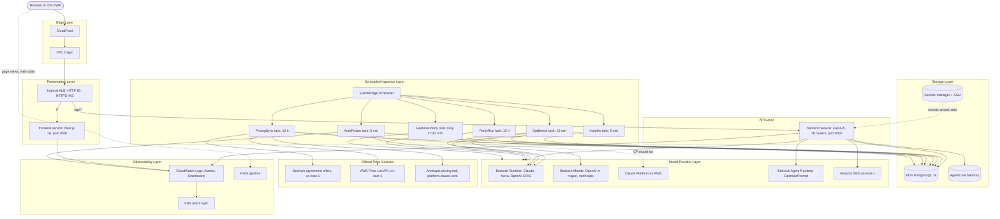
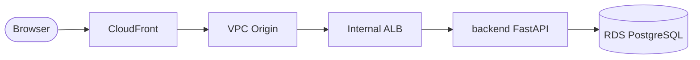
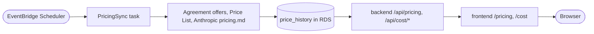
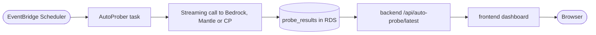
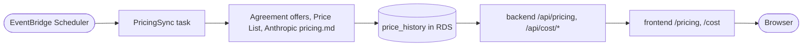

# Bedrock LLM Monitor v2 Architecture

---

# English

## System Overview

Bedrock LLM Monitor v2 measures a 55-channel active catalog across Amazon Bedrock, Claude Platform on AWS (Anthropic CP), and OpenAI GPT on Bedrock (Mantle in-region plus Global and US cross-region profiles). A scheduled AutoProber task probes every channel every 5 minutes, including the 9 Claude Platform on AWS channels (v2.29.1 reverted the v2.29.0 10-minute CP cadence; `ANTHROPIC_CP_PROBE_INTERVAL_S=600` brings it back as an operational lever). Five more scheduled tasks produce AI insights, a 12-hourly model × API surface × feature parity sweep, a 15-minute GPT TTFB/TTFT bench, a daily Claude API Features evidence sweep, and a 12-hourly sync of official unit prices (v2.30.0). A chatbot answers natural-language questions over the stored time series.

Traffic enters through CloudFront at `llm-monitor.whchoi.net` (the default `d36s7ml54xwemr.cloudfront.net` name also works), reaches an internal ALB through a VPC Origin, and is routed to two ECS Fargate services: `frontend` (Next.js standalone) and `backend` (FastAPI). All data lands in a single RDS PostgreSQL instance. Viewers connect over HTTPS. The VPC Origin currently reaches the ALB over HTTP port 80 inside the VPC, a temporary setting in `edge-stack.ts` until the origin switches to `HTTPS_ONLY`; the ALB is internal, sits in private subnets, and its security group admits only the VPC CIDR.

Dashboard model cards grade TTFT, total latency, and TPS values against per-workload-category thresholds (normal blue, warning amber, critical rose). The grading is a pure frontend function in `frontend/src/lib/metricGrade.ts` with no backend involvement (v2.28.0, ADR-029).

Unit prices have one source, the backend `price_history` table (v2.30.0, ADR-030). The PricingSync task reads the Standard input and output price of every active channel from three official sources every 12 hours: the Bedrock agreement-offer rate cards (Bedrock Claude and OpenAI), the AWS Price List API (Nova 2.0 Lite) and Anthropic's `pricing.md` (Claude Platform on AWS). A change above 50% on input or output waits for admin approval. `/api/cost/*` and `/api/efficiency/score` price each probe row at the unit price in effect at its timestamp, and the `/pricing` page, its CSV, Markdown and JSON downloads, Model Explorer and Comparison Lab read `/api/pricing`.

## Full Architecture

## Data Flow Summary

Probe data path (the path every dashboard number takes):

User request path:

Unit price path (v2.30.0, ADR-030):

`/api/auto-probe/status` and `/api/auto-probe/latest` read the latest `ProbeRun(is_auto=1)` rows from the database, not in-process state, because the prober runs in a separate Fargate task. `/latest` returns each model's latest row within its own cadence window (3 intervals: 15 minutes for every channel at the default cadence, 30 minutes for CP when `ANTHROPIC_CP_PROBE_INTERVAL_S=600`), and `/status` exposes `channel_intervals` so the dashboard judges freshness per channel.

## Components by Layer

### Edge

| Resource | Role |
|----------|------|
| CloudFront distribution | Single entry point, alias `llm-monitor.whchoi.net` with a CDK-owned ACM `*.whchoi.net` certificate in us-east-1 (override with `-c monitorDomain` and `-c monitorCertArn`), TLS 1.2_2021 |
| Cache behaviors | `/api/auto-probe/*` honors origin `Cache-Control` (`s-maxage=30`, max TTL 60 s) with gzip and Brotli, query strings in the cache key; other `/api/*` and HTML are not cached (`compress` off on `/api/*` to protect SSE) |
| WAFv2 | Not attached: the CLOUDFRONT scope must be created in us-east-1, so `edge-stack.ts` defers it to a separate stack |
| VPC Origin | CloudFront ENIs in private subnets that reach the internal ALB |
| S3 (CloudFront logs) | Access logs, KMS encrypted, 90-day retention |

### Presentation and API

| Resource | Role |
|----------|------|
| Internal ALB | HTTP 80 listener (what the VPC Origin uses today) and HTTPS 443 listener (`TLS13_RES`, certificate from `albCertificateArn`, ADR-005); both send `/api/*` to backend and everything else to frontend |
| S3 (ALB logs) | ALB access logs, 90-day retention |
| ECS cluster `bedrock-monitor` | Container Insights enabled |
| ECR `bedrock-monitor-backend-v2`, `bedrock-monitor-frontend` | `bedrock-monitor-backend-v2` is created outside CDK with IMMUTABLE tags (ADR-018); the CDK-managed `bedrock-monitor-frontend` (and the legacy `bedrock-monitor-backend`) are MUTABLE, so releases rely on unique `v<epoch>` tags plus digest-pinned task definitions (`pinned-image.ts`) |
| frontend Fargate service | Next.js standalone on port 3000, 0.5 vCPU / 1 GB, CPU autoscaling 1 to 3; pages `/`, `/models`, `/parity`, `/cost`, `/pricing`, `/reliability`, `/efficiency`, `/analysis`, `/gpt-on-aws`, `/claude-features`, `/prompts`, `/chat` |
| backend Fargate service | FastAPI on port 8000, 0.5 vCPU / 1 GB, CPU autoscaling 1 to 3, health-check grace 300 s for startup migrations; 18 router modules under `backend/routers/`; `/api/pricing` keeps a 60 s in-process cache per task |

### Storage

| Resource | Role |
|----------|------|
| RDS PostgreSQL 16.8 (t4g.micro) | 20 GB gp3, Single-AZ, 7-day backups, encrypted; raw `probe_results` older than `RETENTION_DAYS` (60) move to `probe_results_hourly`; `price_history` (unit prices per `model_id` with `effective_from`) and `price_sync_runs` (one row per PricingSync run) since v2.30.0 |
| Secrets Manager `bedrock-monitor/db` | Generated RDS credentials |
| SSM `/bedrock-monitor/jwt-secret-key` | JWT signing key |
| SSM `/bedrock-monitor/agentcore-memory-id` | AgentCore Memory ID |
| SSM `/bedrock-monitor/{seed-admin-password,anthropic-api-key,anthropic-workspace-id,openai-api-key}` | Pre-created SecureStrings read by AppServices and Scheduler; `openai-1p-api-key` only when `ENABLE_OPENAI_1P=true` |

### AI and Model Providers

| Resource | Role |
|----------|------|
| Bedrock Runtime | Bedrock Claude Fable 5.1, Fable 5, Opus 5.5, Opus 5, Opus 4.8, Opus 4.7, Opus 4.6, Sonnet 5, Sonnet 4.6, Haiku 4.5 (Global and US profiles) and Nova 2.0 Lite US: 21 channels. OpenAI Global and US CRIS profiles go through the Bedrock Runtime OpenAI-compatible endpoints in Seoul and us-east-1 |
| Bedrock Mantle | OpenAI GPT 5.4, 5.5, 5.6 Sol, Terra, Luna and GPT 6 Astra, Sol, Luna in-region (16 channels); `/anthropic` surface for the parity run and Claude API Features in `MANTLE_ANTHROPIC_REGION=us-east-1` (ADR-026) |
| Claude Platform on AWS | 9 Anthropic channels at `aws-external-anthropic.us-east-2.api.aws` with a workspace ID header |
| OpenAI channel total | 25 = Mantle in-region 16 + Global CRIS 6 + US CRIS 3; the OpenAI 1P direct path (5 channels) is dormant and hidden since v2.19.1 |
| Chatbot | Claude Sonnet 4.6 (`CHAT_MODEL_ID` in `backend/agent/bedrock.py`) with 4 tools; follow-up questions from Claude Haiku 4.5 (`backend/routers/chat.py`) |
| Insights | Claude Sonnet 4.6 (`INSIGHTS_MODEL_ID`) writes KO and EN summaries of the last 6 hours |
| AgentCore Memory `BedrockMonitorChatMemory` | Chat context, 30-day retention; IAM managed policy attached to the backend task role |
| Bedrock Agent Runtime OptimizePrompt | `/api/prompts/optimize` in `BEDROCK_OPTIMIZE_REGION` (default us-east-1) |
| Amazon SES (us-east-1) | Registration approval email to the admin address |
| Official price sources | Bedrock `ListFoundationModelAgreementOffers` (us-east-1, 18 foundation models), AWS Price List `GetProducts` (us-east-1, Nova 2.0 Lite) and `https://platform.claude.com/docs/en/about-claude/pricing.md` (Claude Platform on AWS); read only by the PricingSync task (ADR-030) |

### Scheduled Ingestion

| Schedule | Expression | Task command | Output |
|----------|------------|--------------|--------|
| `AutoProberSchedule` | `rate(5 minutes)` | `python -m auto_prober_runner --once` | One `ProbeRun` plus 55 `probe_results` rows per cycle, all with the cycle's category (default `ANTHROPIC_CP_PROBE_INTERVAL_S=300`, v2.29.1); with `600`, `_plan_cycle` probes CP channels every other cycle with their own category rotation (46 or 55 rows per cycle) |
| `InsightsSchedule` | `rate(5 minutes)` | `python -m insights_runner --window 6h` | `Insight` rows (KO and EN) |
| `ParityRunSchedule` | `rate(12 hours)` | `python -m parity_runner --once` | Model × 6 surfaces × 19 features evidence cells |
| `GptBenchSchedule` | `rate(15 minutes)` | `python -m gptbench_runner --once` | 18 GPT channels (Mantle in-region 11 + CRIS 7) × 10 sequential calls; per-call watchdog `GPT_BENCH_CALL_TIMEOUT` 90 s, cycle deadline `GPT_BENCH_DEADLINE` 780 s |
| `FeaturesVerifySchedule` | `cron(30 17 * * ? *)` Etc/UTC | `python -m features_runner --once` | 39 rows × 5 surfaces × 5 models (Claude Fable 5.1, Fable 5, Opus 5.5, Opus 5, Sonnet 5) = 975 cells (813 probed + 162 pre-decided), about 9 minutes, daily at 17:30 UTC (02:30 KST) |
| `PricingSyncSchedule` | `rate(12 hours)` | `python -m pricing_sync_runner --once` | One `price_sync_runs` row (`completed`, `partial` or `failed`) and, per active channel, an unchanged observation, a new `verified` price (change of 50% or less) or a `pending_review` row; run cap 300 s; `pg_try_advisory_lock(917350004)` keeps runs from overlapping — a second run exits at once (exit 1, no run row) (v2.30.0, ADR-030) |

Every scheduled task uses the backend image with a command override, 0.5 vCPU / 1 GB, and a task definition family `:*` wildcard in the scheduler role's `ecs:RunTask` policy (ADR-011). PricingSync runs with its own task role that allows only `bedrock:ListFoundationModelAgreementOffers` and `pricing:GetProducts`, with no model invocation.

### Network

| Resource | Role |
|----------|------|
| VPC 10.20.0.0/16 (or an existing VPC) | 2 AZs with Public, App, and Data subnets |
| NAT gateway × 1 | Egress for App subnets to endpoints without PrivateLink coverage (Claude Platform on AWS, Mantle, OpenAI CRIS in us-east-1, and for PricingSync the Bedrock control plane and Price List API in us-east-1 plus `platform.claude.com`) |
| Interface VPC endpoints × 9 | ECR API, ECR Docker, CloudWatch Logs, SSM, SSM Messages, Secrets Manager, KMS, Bedrock Runtime, Bedrock AgentCore |
| Gateway VPC endpoint × 1 | S3 |

### Observability

| Resource | Role |
|----------|------|
| CloudWatch log groups | `/ecs/{backend,frontend,autoprober,insights,parityrun,gptbench,features,pricingsync}`, 14-day retention |
| CloudWatch alarms × 7 | ALB 5xx ratio, ALB latency, backend and frontend running task count, RDS CPU, storage, connections |
| CloudWatch dashboard `BedrockMonitor-v2` | 4 graph widgets plus an alarm status widget |
| SNS topic `bedrock-monitor-alarms` | Alarm fan-out |
| RUM (aws-rum-pipeline) | Page views, dwell time, Web Vitals, JS errors; `NEXT_PUBLIC_RUM_*` injected at frontend build time (ADR-024) |

### Security

| Control | Where |
|---------|-------|
| Transport | Viewer to CloudFront over HTTPS (TLS 1.2_2021); CloudFront to ALB over HTTP 80 through the VPC Origin, private to the VPC, until `edge-stack.ts` switches the origin to `HTTPS_ONLY` |
| WAF | Not attached yet (see Edge) |
| Authentication | JWT bearer (24 h) with bcrypt passwords; register requires an email username and admin approval; `/api/admin/*` is admin only |
| Secrets | Secrets Manager (DB), SSM SecureString (JWT key, Anthropic key and workspace, OpenAI bearer) injected as ECS secrets |
| Private networking | ALB, RDS, and tasks in private subnets; AWS API traffic over interface endpoints |

## CDK Stacks

| Stack | Depends on | Responsibility |
|-------|------------|----------------|
| Network | none | VPC, NAT gateway, VPC endpoints |
| Data | Network | RDS, Secrets Manager, SSM parameters |
| Cluster | Network | ECS cluster, ECR repositories, shared KMS key |
| AgentCore | none | AgentCore Memory and IAM policy |
| AppServices | Network, Data, Cluster, AgentCore | frontend and backend Fargate services, internal ALB, ALB logs |
| Edge | AppServices | CloudFront, alias certificate, cache policies, CloudFront logs |
| Scheduler | Network, Data, Cluster, AgentCore | 6 EventBridge schedules and 6 task definitions |
| Observability | AppServices, Cluster, Data | Alarms, dashboard, SNS topic |

Reusable constructs live in `cdk/lib/constructs/`: `fargate-service.ts` (service, target group, autoscaling, log group) and `pinned-image.ts` (digest-pinned image URIs from `-c backendImage=` and `-c frontendImage=`).

## Key Design Decisions

See ADR-001 through ADR-030 in [`docs/decisions/`](./decisions/) (012, 014, 015, and 016 are unused numbers).

| ADR | Decision |
|-----|----------|
| 001 | CloudFront VPC Origin instead of an internet-facing ALB |
| 002 | RDS t4g.micro Single-AZ (time-series loss is acceptable) |
| 003 | AutoProber split into an EventBridge-driven Fargate task |
| 004 | ALB to ECS over HTTP inside the VPC, isolated by security groups |
| 005 | ACM Private CA certificate injected by ARN |
| 006 | AgentCore Memory only, Runtime deferred |
| 007 | SSE through CloudFront: VIEWER_REQUEST only plus simulated streaming |
| 008 | CDK in TypeScript, preferring L2 constructs for new features such as VPC Origin |
| 009 | FloatingChat dual mode (popup and iframe) |
| 010 | Immutable ECR tags, no `:latest` in production |
| 011 | Scheduler IAM `ecs:RunTask` on task definition family `:*` |
| 013 | Output analysis: stop-reason distribution and output length |
| 017 | Model catalog reduction (13 to 12) |
| 018 | New ECR repository `-v2` to work around the Fargate image cache bug |
| 019 | OpenAI on Bedrock Mantle provider path |
| 020 | OpenAI 1P direct provider path (dormant since v2.19.1) |
| 021 | Parity run engine: execution-evidence probe matrix, HTTP 200 is not enough |
| 022 | Mantle `/anthropic` surface: SigV4-derived bearer and IAM action chain |
| 023 | Parity features expanded to 19: applicability map, honest exclusions, request snapshots |
| 024 | RUM integration with a self-hosted SDK and build-time `NEXT_PUBLIC_*` values |
| 025 | GPT-5.6 Global CRIS channels and per-channel pricing |
| 026 | Claude API Features matrix: documented vs observed drift, Mantle `/anthropic` in us-east-1 |
| 027 | GPT-6 Astra: inference-profile-only OpenAI model, US CRIS pseudo-region `us`, Mantle in-region us-west-2 only |
| 028 | Claude Opus 5.5 and GPT-6 Sol, Luna: CP point-release guard `_is_point_release_of`, Sol and Luna Mantle in-region us-east-1 only, agreement-offer pricing |
| 029 | Dashboard metric grades: per-category absolute thresholds from 48 h p90/p99, TPS graded on the low side only, `lib/metricGrade.ts` as the single source |
| 030 | Official unit prices synced every 12 hours into a per-`model_id` price history, costs at the price in effect at each probe, 50% guard with admin approval (supersedes the ADR-025 retroactive re-pricing rule) |

## Operations

- **Deploy**: [`docs/runbooks/deploy.md`](./runbooks/deploy.md)
- **Rollback**: [`docs/runbooks/rollback.md`](./runbooks/rollback.md)
- **Troubleshooting**: [`docs/runbooks/troubleshooting.md`](./runbooks/troubleshooting.md)
- **Verify**: `make verify` runs CDK lint, typecheck, tests, and synth, then ruff, pytest, and frontend tsc and vitest.

---

# 한국어

## 시스템 개요

Bedrock LLM Monitor v2는 Amazon Bedrock, Claude Platform on AWS(Anthropic CP), OpenAI GPT on Bedrock(Mantle 인리전과 Global, US 교차 리전 프로파일)에 걸친 활성 55개 채널을 측정합니다. 스케줄된 AutoProber 태스크가 Claude Platform on AWS 9채널을 포함한 모든 채널을 5분마다 프로빙합니다(v2.29.1에서 v2.29.0의 CP 10분 주기를 되돌렸고, `ANTHROPIC_CP_PROBE_INTERVAL_S=600`을 운영 레버로 써서 다시 켤 수 있습니다). 나머지 스케줄 태스크 5개가 AI 인사이트, 12시간 주기 모델 × API surface × 피처 패리티 스윕, 15분 주기 GPT TTFB/TTFT 벤치, 일 1회 Claude API Features 실행 증거 스윕, 12시간 주기 공식 단가 동기화(v2.30.0)를 만듭니다. 챗봇이 저장된 시계열에 대한 자연어 질문에 답합니다.

트래픽은 `llm-monitor.whchoi.net`(기본 이름 `d36s7ml54xwemr.cloudfront.net`도 동작)의 CloudFront로 들어와 VPC Origin을 거쳐 내부 ALB에 도달하고, ECS Fargate 서비스 2개인 `frontend`(Next.js standalone)와 `backend`(FastAPI)로 라우팅됩니다. 모든 데이터는 RDS PostgreSQL 인스턴스 하나에 저장됩니다. 뷰어 구간은 HTTPS입니다. VPC Origin은 현재 VPC 내부에서 HTTP 포트 80으로 ALB에 연결하며, 이는 origin을 `HTTPS_ONLY`로 바꾸기 전까지의 임시 설정입니다(`edge-stack.ts`). ALB는 internal scheme이고 프라이빗 서브넷에 있으며 보안 그룹은 VPC CIDR만 허용합니다.

대시보드 모델 카드는 TTFT, 총 응답시간, TPS 값을 워크로드 카테고리별 임계치로 등급 표시합니다(양호 파랑, 경고 호박, 위험 장미). 등급 판정은 `frontend/src/lib/metricGrade.ts`의 순수 프런트엔드 함수이며 백엔드는 관여하지 않습니다(v2.28.0, ADR-029).

단가의 출처는 backend `price_history` 테이블 하나입니다(v2.30.0, ADR-030). PricingSync 태스크가 12시간마다 공식 출처 3개에서 활성 채널의 Standard 입력, 출력 단가를 읽습니다. Bedrock agreement offer rate card(Bedrock Claude, OpenAI), AWS Price List API(Nova 2.0 Lite), Anthropic `pricing.md`(Claude Platform on AWS)입니다. 입력이나 출력이 50%를 넘게 바뀌면 관리자 승인을 기다립니다. `/api/cost/*`와 `/api/efficiency/score`는 프로브 행마다 그 시각에 유효했던 단가로 비용을 계산하고, `/pricing` 페이지와 CSV, Markdown, JSON 다운로드, 모델 탐색, Comparison Lab은 `/api/pricing`을 읽습니다.

## 전체 아키텍처

## 데이터 흐름 요약

프로브 데이터 경로(대시보드의 모든 수치가 지나는 경로):

사용자 요청 경로:

단가 경로(v2.30.0, ADR-030):

프로버가 별도 Fargate 태스크에서 돌기 때문에 `/api/auto-probe/status`와 `/api/auto-probe/latest`는 프로세스 내부 상태가 아니라 DB의 최신 `ProbeRun(is_auto=1)` 행을 읽습니다. `/latest`는 모델마다 자기 주기 범위 안의 최신 행을 돌려주고(주기 3회: 기본 주기에서는 모든 채널 15분, `ANTHROPIC_CP_PROBE_INTERVAL_S=600`이면 CP는 30분), `/status`는 `channel_intervals`를 내보내 대시보드가 채널별로 신선도를 판정합니다.

## 레이어별 컴포넌트

### Edge

| 리소스 | 역할 |
|--------|------|
| CloudFront distribution | 단일 진입점, alias `llm-monitor.whchoi.net` + CDK가 소유하는 us-east-1 ACM `*.whchoi.net` 인증서(`-c monitorDomain`, `-c monitorCertArn`로 교체), TLS 1.2_2021 |
| Cache behaviors | `/api/auto-probe/*`는 원본 `Cache-Control`(`s-maxage=30`, 최대 TTL 60초)을 따르고 gzip, Brotli 압축, 쿼리스트링을 캐시 키에 포함, 나머지 `/api/*`와 HTML은 캐시하지 않음(SSE 보호를 위해 `/api/*`는 `compress` 끔) |
| WAFv2 | 미연결: CLOUDFRONT scope는 us-east-1에 만들어야 해서 `edge-stack.ts`가 별도 스택으로 미룸 |
| VPC Origin | 프라이빗 서브넷의 CloudFront ENI가 내부 ALB에 연결 |
| S3 (CloudFront logs) | 액세스 로그, KMS 암호화, 90일 보존 |

### Presentation, API

| 리소스 | 역할 |
|--------|------|
| Internal ALB | HTTP 80 리스너(현재 VPC Origin이 사용)와 HTTPS 443 리스너(`TLS13_RES`, `albCertificateArn` 인증서, ADR-005), 둘 다 `/api/*`는 backend, 나머지는 frontend |
| S3 (ALB logs) | ALB 액세스 로그, 90일 보존 |
| ECS cluster `bedrock-monitor` | Container Insights 활성 |
| ECR `bedrock-monitor-backend-v2`, `bedrock-monitor-frontend` | `bedrock-monitor-backend-v2`는 CDK 밖에서 IMMUTABLE 태그로 만든 저장소(ADR-018), CDK가 관리하는 `bedrock-monitor-frontend`(와 옛 `bedrock-monitor-backend`)는 MUTABLE이라 릴리스는 고유 `v<epoch>` 태그와 digest 고정 태스크 정의(`pinned-image.ts`)에 의존 |
| frontend Fargate service | Next.js standalone 포트 3000, 0.5 vCPU / 1 GB, CPU 오토스케일 1~3, 페이지 `/`, `/models`, `/parity`, `/cost`, `/pricing`, `/reliability`, `/efficiency`, `/analysis`, `/gpt-on-aws`, `/claude-features`, `/prompts`, `/chat` |
| backend Fargate service | FastAPI 포트 8000, 0.5 vCPU / 1 GB, CPU 오토스케일 1~3, 기동 마이그레이션용 헬스체크 유예 300초, `backend/routers/` 라우터 모듈 18개, `/api/pricing`은 태스크마다 60초 인메모리 캐시 |

### Storage

| 리소스 | 역할 |
|--------|------|
| RDS PostgreSQL 16.8 (t4g.micro) | 20 GB gp3, Single-AZ, 7일 백업, 암호화, `RETENTION_DAYS`(60)를 넘은 원본 `probe_results`는 `probe_results_hourly`로 이관, v2.30.0부터 `price_history`(`model_id`별 단가와 `effective_from`)와 `price_sync_runs`(PricingSync 런마다 1행) |
| Secrets Manager `bedrock-monitor/db` | 자동 생성 RDS 자격 증명 |
| SSM `/bedrock-monitor/jwt-secret-key` | JWT 서명 키 |
| SSM `/bedrock-monitor/agentcore-memory-id` | AgentCore Memory ID |
| SSM `/bedrock-monitor/{seed-admin-password,anthropic-api-key,anthropic-workspace-id,openai-api-key}` | AppServices, Scheduler가 읽는 사전 생성 SecureString, `openai-1p-api-key`는 `ENABLE_OPENAI_1P=true`일 때만 |

### AI, 모델 프로바이더

| 리소스 | 역할 |
|--------|------|
| Bedrock Runtime | Bedrock Claude Fable 5.1, Fable 5, Opus 5.5, Opus 5, Opus 4.8, Opus 4.7, Opus 4.6, Sonnet 5, Sonnet 4.6, Haiku 4.5(Global, US 프로파일)와 Nova 2.0 Lite US, 21채널. OpenAI Global, US CRIS 프로파일은 서울, us-east-1 Bedrock Runtime OpenAI 호환 엔드포인트로 호출 |
| Bedrock Mantle | OpenAI GPT 5.4, 5.5, 5.6 Sol, Terra, Luna와 GPT 6 Astra, Sol, Luna 인리전(16채널), 패리티 런과 Claude API Features용 `/anthropic` surface는 `MANTLE_ANTHROPIC_REGION=us-east-1` (ADR-026) |
| Claude Platform on AWS | `aws-external-anthropic.us-east-2.api.aws` + workspace ID 헤더로 호출하는 Anthropic 9채널 |
| OpenAI 채널 합계 | 25 = Mantle 인리전 16 + Global CRIS 6 + US CRIS 3, OpenAI 1P direct 경로(5채널)는 v2.19.1부터 휴면, 비노출 |
| 챗봇 | Claude Sonnet 4.6(`backend/agent/bedrock.py` `CHAT_MODEL_ID`) + 도구 4개, 후속 질문은 Claude Haiku 4.5(`backend/routers/chat.py`) |
| 인사이트 | Claude Sonnet 4.6(`INSIGHTS_MODEL_ID`)이 최근 6시간 KO, EN 요약 작성 |
| AgentCore Memory `BedrockMonitorChatMemory` | 대화 컨텍스트 30일 보존, IAM 관리형 정책을 backend 태스크 역할에 연결 |
| Bedrock Agent Runtime OptimizePrompt | `/api/prompts/optimize`, `BEDROCK_OPTIMIZE_REGION`(기본 us-east-1) |
| Amazon SES (us-east-1) | 가입 승인 메일을 관리자 주소로 발송 |
| 공식 단가 출처 | Bedrock `ListFoundationModelAgreementOffers`(us-east-1, 파운데이션 모델 18개), AWS Price List `GetProducts`(us-east-1, Nova 2.0 Lite), `https://platform.claude.com/docs/en/about-claude/pricing.md`(Claude Platform on AWS), PricingSync 태스크만 읽음 (ADR-030) |

### 스케줄 수집

| 스케줄 | 표현식 | 태스크 명령 | 산출물 |
|--------|--------|-------------|--------|
| `AutoProberSchedule` | `rate(5 minutes)` | `python -m auto_prober_runner --once` | 사이클마다 `ProbeRun` 1개 + `probe_results` 55행, 모두 사이클 카테고리(기본 `ANTHROPIC_CP_PROBE_INTERVAL_S=300`, v2.29.1). `600`이면 `_plan_cycle`이 CP 채널을 두 사이클에 한 번 자체 카테고리 순환으로 선택(사이클마다 46행 또는 55행) |
| `InsightsSchedule` | `rate(5 minutes)` | `python -m insights_runner --window 6h` | `Insight` 행(KO, EN) |
| `ParityRunSchedule` | `rate(12 hours)` | `python -m parity_runner --once` | 모델 × surface 6개 × 피처 19개 실행 증거 셀 |
| `GptBenchSchedule` | `rate(15 minutes)` | `python -m gptbench_runner --once` | GPT 18채널(Mantle 인리전 11 + CRIS 7) × 순차 10회, 호출당 watchdog `GPT_BENCH_CALL_TIMEOUT` 90초, 사이클 데드라인 `GPT_BENCH_DEADLINE` 780초 |
| `FeaturesVerifySchedule` | `cron(30 17 * * ? *)` Etc/UTC | `python -m features_runner --once` | 39행 × surface 5개 × 모델 5개(Claude Fable 5.1, Fable 5, Opus 5.5, Opus 5, Sonnet 5) = 975셀(프로브 813 + 사전판정 162), 약 9분, 매일 17:30 UTC(02:30 KST) |
| `PricingSyncSchedule` | `rate(12 hours)` | `python -m pricing_sync_runner --once` | `price_sync_runs` 1행(`completed`, `partial`, `failed`)과 활성 채널마다 변경 없음 관측, 새 `verified` 단가(변화 50% 이하), `pending_review` 행 중 하나, 런 상한 300초, `pg_try_advisory_lock(917350004)`로 런이 겹치지 않게 한다 — 겹치면 두 번째 런은 즉시 exit 1로 끝난다(런 행 없음) (v2.30.0, ADR-030) |

모든 스케줄 태스크는 backend 이미지를 command override로 쓰고 0.5 vCPU / 1 GB이며, 스케줄러 역할의 `ecs:RunTask` 정책은 태스크 정의 family `:*` 와일드카드를 씁니다(ADR-011). PricingSync는 `bedrock:ListFoundationModelAgreementOffers`와 `pricing:GetProducts`만 허용하는 전용 태스크 역할로 돌며 모델 호출 권한이 없습니다.

### Network

| 리소스 | 역할 |
|--------|------|
| VPC 10.20.0.0/16 (또는 기존 VPC) | 2 AZ, Public, App, Data 서브넷 |
| NAT gateway × 1 | PrivateLink가 없는 엔드포인트(Claude Platform on AWS, Mantle, us-east-1 OpenAI CRIS, PricingSync가 쓰는 us-east-1 Bedrock control plane과 Price List API, `platform.claude.com`)로 가는 App 서브넷 egress |
| Interface VPC endpoints × 9 | ECR API, ECR Docker, CloudWatch Logs, SSM, SSM Messages, Secrets Manager, KMS, Bedrock Runtime, Bedrock AgentCore |
| Gateway VPC endpoint × 1 | S3 |

### Observability

| 리소스 | 역할 |
|--------|------|
| CloudWatch log groups | `/ecs/{backend,frontend,autoprober,insights,parityrun,gptbench,features,pricingsync}`, 14일 보존 |
| CloudWatch alarms × 7 | ALB 5xx 비율, ALB 지연, backend, frontend 실행 태스크 수, RDS CPU, 스토리지, 연결 수 |
| CloudWatch dashboard `BedrockMonitor-v2` | 그래프 위젯 4개 + 알람 상태 위젯 1개 |
| SNS topic `bedrock-monitor-alarms` | 알람 fan-out |
| RUM (aws-rum-pipeline) | 페이지뷰, 체류 시간, Web Vitals, JS 에러, `NEXT_PUBLIC_RUM_*`는 frontend 빌드 타임 주입 (ADR-024) |

### Security

| 통제 | 위치 |
|------|------|
| 전송 구간 | 뷰어에서 CloudFront는 HTTPS(TLS 1.2_2021), CloudFront에서 ALB는 VPC Origin을 거친 VPC 내부 HTTP 80이며 `edge-stack.ts`가 origin을 `HTTPS_ONLY`로 바꿀 때까지 유지 |
| WAF | 아직 미연결 (Edge 참고) |
| 인증 | JWT bearer(24시간) + bcrypt 비밀번호, 가입은 이메일 username과 관리자 승인 필수, `/api/admin/*`는 관리자 전용 |
| 시크릿 | Secrets Manager(DB), SSM SecureString(JWT 키, Anthropic 키와 workspace, OpenAI bearer)을 ECS secrets로 주입 |
| 프라이빗 네트워킹 | ALB, RDS, 태스크는 프라이빗 서브넷, AWS API 트래픽은 인터페이스 엔드포인트 경유 |

## CDK 스택

| 스택 | 의존 | 책임 |
|------|------|------|
| Network | 없음 | VPC, NAT gateway, VPC 엔드포인트 |
| Data | Network | RDS, Secrets Manager, SSM 파라미터 |
| Cluster | Network | ECS 클러스터, ECR 저장소, 공유 KMS 키 |
| AgentCore | 없음 | AgentCore Memory, IAM 정책 |
| AppServices | Network, Data, Cluster, AgentCore | frontend, backend Fargate 서비스, 내부 ALB, ALB 로그 |
| Edge | AppServices | CloudFront, alias 인증서, 캐시 정책, CloudFront 로그 |
| Scheduler | Network, Data, Cluster, AgentCore | EventBridge 스케줄 6개, 태스크 정의 6개 |
| Observability | AppServices, Cluster, Data | 알람, 대시보드, SNS 토픽 |

재사용 construct는 `cdk/lib/constructs/`에 있습니다. `fargate-service.ts`(서비스, 타깃 그룹, 오토스케일, 로그 그룹)와 `pinned-image.ts`(`-c backendImage=`, `-c frontendImage=`로 받은 digest 고정 이미지 URI)입니다.

## 핵심 설계 결정

[`docs/decisions/`](./decisions/)의 ADR-001~ADR-030을 참조합니다(012, 014, 015, 016은 결번).

| ADR | 결정 |
|-----|------|
| 001 | 인터넷 대면 ALB 대신 CloudFront VPC Origin |
| 002 | RDS t4g.micro Single-AZ (시계열 손실 허용) |
| 003 | AutoProber를 EventBridge 구동 Fargate 태스크로 분리 |
| 004 | VPC 내부 ALB에서 ECS 구간은 HTTP, 보안 그룹으로 격리 |
| 005 | ACM Private CA 인증서를 ARN으로 주입 |
| 006 | AgentCore Memory만 사용, Runtime은 이연 |
| 007 | CloudFront 경유 SSE: VIEWER_REQUEST only + simulated streaming |
| 008 | CDK TypeScript, VPC Origin 같은 신기능은 L2 construct 우선 |
| 009 | FloatingChat 듀얼 모드 (popup, iframe) |
| 010 | ECR 불변 태그, production `:latest` 금지 |
| 011 | Scheduler IAM `ecs:RunTask`를 태스크 정의 family `:*`로 |
| 013 | 출력 분석: stop reason 분포와 출력 길이 |
| 017 | 모델 카탈로그 축소 (13 → 12) |
| 018 | Fargate 이미지 캐시 버그 우회용 신규 ECR 저장소 `-v2` |
| 019 | OpenAI on Bedrock Mantle 프로바이더 경로 |
| 020 | OpenAI 1P direct 프로바이더 경로 (v2.19.1부터 휴면) |
| 021 | 패리티 런 엔진: 실행 증거 프로브 매트릭스, HTTP 200만으로는 불충분 |
| 022 | Mantle `/anthropic` surface: SigV4 파생 bearer와 IAM 액션 체인 |
| 023 | 패리티 피처 19종 확장: 적용 맵, 정직한 제외, 요청 스냅샷 |
| 024 | 자체 호스팅 SDK와 빌드 타임 `NEXT_PUBLIC_*` 값을 쓰는 RUM 통합 |
| 025 | GPT-5.6 Global CRIS 채널과 채널별 가격 |
| 026 | Claude API Features 매트릭스: 문서 대비 실측 드리프트, Mantle `/anthropic`은 us-east-1 |
| 027 | GPT-6 Astra: 추론 프로파일 전용 OpenAI 모델, US CRIS 유사 리전 `us`, Mantle 인리전은 us-west-2만 |
| 028 | Claude Opus 5.5와 GPT-6 Sol, Luna: CP 점 버전 가드 `_is_point_release_of`, Sol, Luna Mantle 인리전은 us-east-1만, agreement offer 단가 |
| 029 | 대시보드 지표 등급: 48시간 p90/p99 기반 카테고리별 절대 임계치, TPS는 낮은 쪽만 판정, `lib/metricGrade.ts` 단일 출처 |
| 030 | 공식 단가 12시간 자동 동기화와 `model_id` 단위 단가 이력, 프로브 시각 기준 단가로 비용 계산, 50% 안전장치와 관리자 승인 (ADR-025의 소급 재계산 규칙 대체) |

## 운영

- **배포**: [`docs/runbooks/deploy.md`](./runbooks/deploy.md)
- **롤백**: [`docs/runbooks/rollback.md`](./runbooks/rollback.md)
- **장애 대응**: [`docs/runbooks/troubleshooting.md`](./runbooks/troubleshooting.md)
- **검증**: `make verify`가 CDK lint, typecheck, 테스트, synth 뒤 ruff, pytest, frontend tsc, vitest를 실행합니다.
