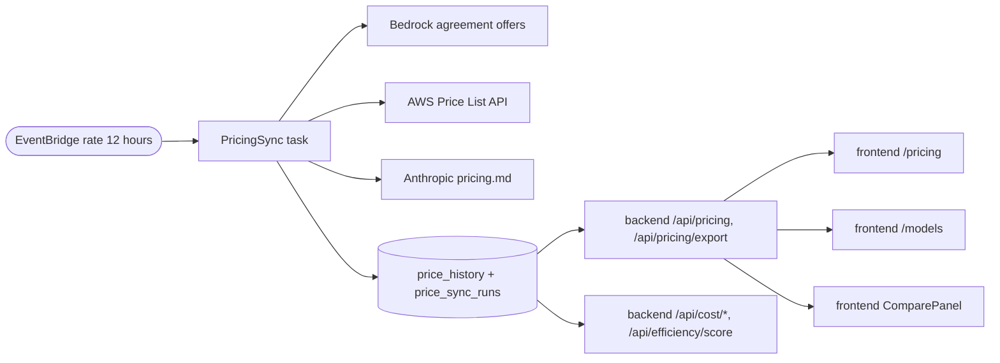

# Design: 비용 단가 메뉴 — 공식 단가 12시간 자동 갱신 + 시점 단가 비용 계산

- **Date**: 2026-09-26
- **Branch**: `feat/v2-30-pricing-menu` (main `8ffb283`, v2.29.1 기준)
- **Version**: v2.30.0
- **Status**: Approved (design) — 2026-09-26, 설계 검토 3렌즈(결정 일관성, 코드 대조, 출처 사실) 46건 반영
- **Related**: ADR-019/020/025/027/028 (단가 키와 채널별 단가), ADR-018 (digest 고정 배포), ADR-011 (Scheduler IAM), ADR-030 (본 기능, 신규 — ADR-025의 "조회 시점 소급 계산" 정책을 대체)

## Goal

모델별 토큰 단가를 한 화면에서 보여 주는 **새 메뉴 `/pricing`("비용 단가" / "Unit Prices")**을 추가한다. 단가는
코드에 고정된 값이 아니라 **공식 출처에서 12시간마다 자동으로 갱신**하고, 비용 화면과 효율성 점수는 **각 프로브
시각에 유효했던 단가**로 계산한다. 가격표는 CSV, Markdown, JSON으로 내려받을 수 있고, 모든 공식 단가에는 출처가
각주로 붙으며, 화면과 파일 모두 "참고용이며 AWS 공식 입장이 아님, 최종 가격은 공식 사이트에서 확인"을 표기한다.

## Scope decisions (사용자 결정, 2026-09-26)

1. 화면 범위: **단가 표 + 참고 자료**. 비교 지표(합계, 할인율 열, 수치 비교 문장)와 실측 호출당 비용은 넣지 않는다.
2. 데이터 원천: **백엔드 단일 출처**. `GET /api/pricing`을 신설하고 프런트엔드 단가 미러(`frontend/src/lib/pricing.ts`의 `PRICE_TABLE`, `getPricing`, `estimateCost`)는 없앤다.
3. 표 단위: **모델 패밀리 1행 + 채널 열**(Claude Platform on AWS / Global / US / In-Region).
4. 참고 자료: **각주 번호 + 페이지 하단 목록**. 각주를 누르면 해당 항목으로 이동한다.
5. 다운로드: **CSV, Markdown, JSON**.
6. 갱신: **12시간마다 자동**.
7. 반영 범위: **표시와 비용 계산 모두**, 단가 이력을 보존해 과거 프로브는 당시 단가로 계산한다. 이 "당시 단가" 계산은 **첫 동기화 런 이후의 변경부터** 적용된다. v2.30.0 이전 구간의 알려진 단가 변경(2026-07-30 GPT-5.6 Luna, Terra 인하, GPT-5.6 Sol 프로모션 시작)은 재구성하지 않고, seed(현재 공식 단가)가 과거 전체에 적용된다 — 기존 조회 시점 소급 계산과 결과가 같다(검토 권장안 A).
8. 코드 단가 오류 11채널(아래)은 **과거까지 교정**한다(단가 변경이 아니라 처음부터 틀린 값이므로).
9. 면책 문구: 상단(눈에 띄는 안내 상자)과 하단(참고 자료 끝)에 표기하고, 다운로드 파일에도 넣는다.
10. 통화는 USD만, 단가는 Standard 등급 입력/출력만(캐시, batch, long-context, priority/flex 제외).
11. 휴면 1P 채널과 숨김 채널(`HIDDEN_MODEL_PATTERNS`)은 제외한다.

## 공식 출처 조사 결과 (2026-09-26 스파이크, 읽기 전용, 검토에서 재검증)

활성 55채널 = Bedrock Claude 20(Global 10 + US 10) + Claude Platform on AWS 9 + Nova 1 + OpenAI 25. 단일 출처로는
전부를 덮을 수 없고, 공식 출처 3개를 조합하면 55채널 전부를 기계적으로 읽을 수 있다.

| 출처 | 대상 채널 | 호출 | 비고 |
|---|---|---|---|
| **Bedrock agreement offer rate card** | Bedrock Claude 20 + OpenAI 25 (FM 18개 = Claude 10 + OpenAI 8) | `bedrock.list_foundation_model_agreement_offers(modelId=<FM id>, offerType="PUBLIC")` | 리전 무관(us-east-1, ap-northeast-2 동일 offerId, rateCard). 호출당 1~2초, 응답 13 KB~442 KB, FM 18개 합계 약 25초. `amazon.nova-2-lite-v1:0`은 `ValidationException: Agreement not supported for this model`이라 호출 대상에서 제외한다. IAM `bedrock:ListFoundationModelAgreementOffers` |
| **AWS Price List API** | Nova 2.0 Lite | `pricing.get_products(ServiceCode="AmazonBedrock", Filters=[usagetype 정확 일치])`, 엔드포인트 us-east-1 | 단위 `1K tokens` → ×1000. IAM `pricing:GetProducts` |
| **Anthropic 공식 단가 문서** | Claude Platform on AWS 9 | `GET https://platform.claude.com/docs/en/about-claude/pricing.md` (비인증 text/markdown, 약 47 KB) | "## Model pricing" 첫 표. 문서가 CP on AWS는 Claude API와 같은 표준 단가라고 명시. robots는 `/api/`만 금지. UA 명시, 12시간 1회 |

### 차원(dimension) 선택 규칙 — agreement offer

- 오퍼는 `offerType=PUBLIC`에서 **정확히 1개**여야 한다. 0개나 2개 이상이면 그 FM의 채널은 이번 런에서 변경 없음.
- 차원 이름은 다음 정규식에 **완전 일치**할 때만 후보가 된다. 리전 접두는 허용 목록이다.
  `^(?:(?P<rc>APN2|USE1|USE2|USW2)_)?(?:(?P<io>input|output)_tokens(?P<g>_global)?_standard|(?P<IO>Input|Output)TokenCount(?P<G>_Global)?)$`
  그래서 batch, flex, priority, long_ctx, `_LCtx`, cache, `Reserved_*_TPM_*`, GovCloud(`UGE1_`, `UGW1_`), 기타 접두(`EU_` 등)는 후보에 들어오지 않는다. `price <= 0`도 버린다. 값은 `Decimal(str(price))`로 파싱한다.
- 스킴은 세 가지가 섞여 있다: 평면(`input_tokens_standard`, OpenAI 5.6/6), 리전 접두(`USE1_input_tokens_standard`, Claude 5.x/4.7/4.8/Fable, OpenAI 5.4/5.5), 레거시(`USE1_InputTokenCount`, `APN2_InputTokenCount_Global`, Opus 4.6/Sonnet 4.6). Haiku 4.5는 신규와 레거시가 같은 값으로 중복된다.
- 채널별 선택 순서(첫 번째로 입력과 출력이 모두 있는 후보를 쓴다):
  - `global`(Seoul에서 호출하는 `global.*`, OpenAI `openai:global:*`): `APN2_*_global_standard` → `USE1_*_global_standard` → 평면 `*_global_standard` → 레거시 `APN2_*TokenCount_Global` → `USE1_*TokenCount_Global`
  - `us`(us-east-1에서 호출하는 `us.*`, OpenAI `openai:us:*`): `USE1_*_standard` → 평면 `*_standard` → 레거시 `USE1_*TokenCount`
  - `inregion:<region>`(OpenAI Mantle): 리전 접두(us-east-1 → `USE1_`, us-east-2 → `USE2_`, us-west-2 → `USW2_`) → 평면 `*_standard`
- 단위는 전부 `Units`로만 나와 스케일 정보가 없다. **USD per 1M tokens로 해석**하고, fixture로 알려진 카드 값(GPT-6 Astra standard 11/55, global 10/50)과 일치함을 고정한다.

### Price List (Nova 2.0 Lite)

- `ServiceCode=AmazonBedrock`, `usagetype` 정확 일치 `USE1-Nova2.0Lite-input-tokens` / `USE1-Nova2.0Lite-output-tokens`. `pricePerUnit.USD`와 `unit`(`1K tokens`)을 확인하고 ×1000. 단위가 다르면 변경 없음.
- 채널 `us.amazon.nova-2-lite-v1:0`은 us-east-1에서 호출하는 US(Geo) 채널이므로 USE1 regional 행을 쓴다.

### Anthropic 문서 (Claude Platform on AWS)

- 표 헤더 이름으로 열을 찾는다("Model", "Base input tokens", "Output tokens"). 열 순서에 기대지 않는다.
- **모델명 셀과 값 셀 모두**에서 `<sup>…</sup>`를 먼저 지운다. 실제 문서의 Sonnet 5 행은 값 셀이 `$2 / MTok<sup>3</sup>`이다.
- 모델명은 끝의 괄호 그룹을 지운다(마크다운 링크 포함 — 예 `([limited availability](https://anthropic.com/glasswing))`, 정규식 `\s*\((?:[^()]|\([^()]*\))*\)\s*$`). 그 뒤 명시적 매핑 표와 **정확 일치**로만 연결한다. 부분 일치와 접두 일치는 금지한다: 표에서 "Claude Opus 5.5"가 "Claude Opus 5"보다, "Claude Fable 5.1"이 "Claude Fable 5"보다 먼저 나오므로 접두 일치면 Opus 5가 5.5 행($4/$20, 정답 $5/$25)에 붙는다(prober `_is_point_release_of` 실사고와 같은 유형).
- 값은 `^\$(\d+(?:\.\d+)?) / MTok$`에 완전 일치할 때만 받는다. prober는 `inference_geo`를 쓰지 않으므로 표준 단가를 적용한다.

### 발견된 코드 단가 오류 (과거까지 교정 — 결정 8)

| 채널 | 코드(v2.29.1) | 공식 | 비고 |
|---|---|---|---|
| Bedrock Claude **US** 10채널 (`us.anthropic.*`) | Global과 같은 값 | Global × 1.1 — Fable 5.1 11/55, Fable 5 11/55, Opus 5.5 4.4/22, Opus 5 5.5/27.5, Opus 4.8 5.5/27.5, Opus 4.7 5.5/27.5, Opus 4.6 5.5/27.5, Sonnet 5 2.2/11, Sonnet 4.6 3.3/16.5, Haiku 4.5 1.1/5.5 | `_normalize_key`가 `us.`와 `global.`을 같은 키로 합쳐 약 9.1% 과소 산정 |
| Nova 2.0 Lite (`us.amazon.nova-2-lite-v1:0`) | 0.06/0.24 (1세대 Nova Lite 값) | 0.33/2.75 | 입력 5.5배, 출력 11.5배 과소 |

나머지 44채널(Bedrock Global Claude 10, CP 9, OpenAI 25)은 공식 값과 코드 값이 같다. GPT-5.6 Sol 4.40/22와 Global
4/20은 프로모션 단가인데, 현재 공식 출처 어디에도 프로모션 표시나 종료일이 없다(2026-09-23 모델 카드의
"최소 2026-11-21까지" 문구도 사라졌다). 이 정보는 공식 출처가 아닌 **수동 메모**로만 관리한다(아래 `PRICE_NOTES`).
GPT-6 Sol, Luna 모델 카드는 이제 게시돼 있고 오퍼 값과 일치한다(ADR-028 "게시 시 재대조" 후속 완료).

## Architecture



### 모듈

| 모듈 | 역할 |
|---|---|
| `backend/pricing_sources.py` | 순수 데이터와 분류: `price_identity`, 매핑 표(FM id, Anthropic 문서 모델명, Price List usagetype), `PROVIDER_ORDER`, `FAMILY_ORDER`(프런트와 같은 문자열), `DISCLAIMER`, `OFFICIAL_PAGES`, `PRICE_NOTES` |
| `backend/pricing_seed.py` | 활성 55채널의 공식 단가 seed(`model_id` 단위)와 `ensure_seed(engine)` |
| `backend/pricing_parsers.py` | 출처별 순수 파서(offers rateCard, Price List 상품, Anthropic markdown) |
| `backend/pricing_sync.py` | 동기화 오케스트레이션(가져오기, 비교, 안전장치, 기록) |
| `backend/pricing_sync_runner.py` | CLI `python -m pricing_sync_runner --once`, 끝에 `os._exit` |
| `backend/price_history.py` | 유효 단가 조회, 행 단위 비용 서브쿼리, 계산 상태(verification) |
| `backend/pricing_export.py` | CSV, Markdown, JSON 생성(순수 함수) |
| `backend/routers/pricing.py` | `/api/pricing`, `/api/pricing/export`, `/api/admin/pricing/*` |
| `backend/pricing.py` | `PRICE_TABLE`, `get_pricing`, `_normalize_key`, `estimate_cost_usd` **제거** — 파일을 삭제한다(호환 모듈 없음) |

### 단가 식별자와 저장 단위

- 단가 이력은 **`model_id` 단위**로 저장한다(`probe_results.model_id`와 같은 값). 비용 조인이 정확 일치라 prefix fallback이 구조적으로 사라진다. 같은 단가를 공유하는 채널(예: OpenAI in-region 3개 리전)도 행을 각각 둔다.
- 순수 함수 `price_identity(model_id) -> PriceIdentity | None`(`family_key`, `family`, `provider`, `channel`, `source_ref`)가 모든 활성 채널을 분류한다.
  - `channel` ∈ `cp`, `global`, `us`, `inregion:<region>`
  - `source_ref`: offers FM id(`anthropic.claude-opus-5-5`, `anthropic.claude-haiku-4-5-20251001-v1:0`, `openai.gpt-6-sol`), Price List usagetype 쌍(Nova), 또는 Anthropic 문서 모델명(CP)
  - CP model_id는 런타임 디스커버리로 정해지고 날짜 접미사가 붙을 수 있다(`anthropic:claude-haiku-4-5-20251001`). CP 매핑은 prober `_ANTHROPIC_TARGETS`와 같은 substring과 `_is_point_release_of` 규칙으로 분류하고, fixture에 날짜 접미사 id를 넣는다.
  - 분류할 수 없는 model_id는 예외가 아니라 `None` — 그 채널은 단가 없음(비용 "-")으로 표시하고 경고 로그를 남긴다.
- `family` 문자열은 표시 이름이자 `lib/sortModels.ts` `FAMILY_ORDER` 항목과 바이트 단위로 같아야 한다(예: "Claude Opus 5.5", "GPT 6 Sol", "Nova 2.0 Lite" — 실제 문자열은 `FAMILY_ORDER`에서 가져온다). 백엔드 `FAMILY_ORDER`와 프런트 `FAMILY_ORDER`의 동등성을 pytest가 `frontend/src/lib/sortModels.ts`를 읽어 고정한다.
- 새 모델을 추가할 때 `pricing_sources.py` 매핑과 `pricing_seed.py`도 고쳐야 하며, "활성 채널 전부가 분류되고 seed 단가가 있다"는 테스트가 누락을 잡는다.

### 데이터 모델 (ORM, `Base.metadata.create_all`)

현재 테이블은 raw DDL이 아니라 ORM 모델 + `create_all`로 만든다(테스트도 인메모리 SQLite에 `create_all`). 새 테이블도
`backend/models.py`에 ORM 클래스로 선언하고 lifespan의 ALTER 블록에는 넣지 않는다. `pricing_sync_runner`도 시작할 때
`create_tables()`를 호출한다.

`PriceHistory` (`price_history`)

| 컬럼 | 타입 | 설명 |
|---|---|---|
| `id` | Integer PK | |
| `model_id` | Text, not null | `probe_results.model_id`와 같은 값 |
| `family_key` | Text | 예 `claude-opus-5-5`, `gpt-6-sol`, `nova-2-lite` |
| `channel` | Text | `cp` / `global` / `us` / `inregion:us-east-1` … |
| `input_per_mtok` | Float | USD per 1M input tokens (공식 값은 모두 소수 6자리 이내) |
| `output_per_mtok` | Float | USD per 1M output tokens |
| `effective_from` | DateTime(timezone=True) | 이 단가가 적용되기 시작하는 시각 |
| `source_id` | Text | 참고 자료 id (아래 형식) |
| `status` | Text | `seed` / `verified` / `pending_review` / `rejected` |
| `observed_at` | DateTime(timezone=True), nullable | 출처에서 이 값을 마지막으로 확인한 시각. seed 삽입 시 NULL |
| `run_id` | Integer, nullable | 이 행을 만든(또는 마지막으로 관측한) `price_sync_runs.id` |
| `created_at` | DateTime(timezone=True) | |

- `__table_args__ = (Index("ix_price_history_model_eff", "model_id", "effective_from"),)`.
- **유효 행** = 같은 `model_id`에서 `status IN ('seed','verified')`이고 `effective_from <= t`인 행 중 `(effective_from, id)`가 가장 늦은 행.
- 동기화 비교에만 `Decimal(str(round(v, 6)))`을 쓰고, 저장과 비용 계산은 float다(PostgreSQL `numeric`이 `Decimal`로 돌아와 기존 float 누적에서 `TypeError`가 나는 문제를 피한다).

`PriceSyncRun` (`price_sync_runs`): `id`, `started_at`, `finished_at`(nullable), `status`(`running` / `completed` / `partial` / `failed`), `summary`(JSON: 출처별 ok/failed 수, 채널별 결과 `{model_id: "unchanged"|"changed"|"pending"|"no_baseline"|"skipped:<reason>"}`, 오류 요약), `changes`(적용한 새 행 수), `pending`(검토 대기 수). 런을 시작할 때 `running` 행을 먼저 넣는다.

- 모든 시각은 ORM/Core 바인드 파라미터(`datetime(..., tzinfo=timezone.utc)`)로 넣는다. raw 문자열 시각 리터럴은 쓰지 않는다(SQLite는 DateTime을 문자열로 비교한다).

### 초기값(seed)과 과거 교정

- `pricing_seed.SEED`: 활성 55채널의 **공식 단가**(스파이크와 검토로 확인한 값 — Claude US +10%, Nova 0.33/2.75 교정 포함)를 `model_id` 단위로 둔다. CP는 디스커버리 id가 바뀔 수 있으므로 CP seed는 `family_key`로 두고 `ensure_seed`가 현재 활성 CP model_id에 풀어 넣는다.
- `ensure_seed(engine)`: **model_id 단위 멱등 삽입**. seed에 있는 각 model_id에 대해 `price_history`에 그 model_id 행이 하나도 없을 때만 `effective_from = 1970-01-01T00:00:00Z`, `status='seed'`, `observed_at=NULL`, `source_id`(seed가 근거로 삼은 출처)로 넣는다. 테이블 전체가 비었는지는 보지 않는다.
- `ensure_seed`는 기존 마이그레이션 트랜잭션과 **분리된 자체 트랜잭션**에서 `pg_advisory_xact_lock(917350003)` 아래 실행한다(SQLite는 잠금 생략). 호출 위치는 두 곳이고, 두 곳 모두 **모델 등록(`_discover_anthropic_models`, `_register_openai_models`) 다음**에 부른다(CP seed를 현재 활성 CP model_id로 풀어 넣어야 하므로): backend lifespan(마이그레이션 블록과 모델 등록 다음, 실패해도 기동 계속)과 `pricing_sync_runner`(모델 등록 → `ensure_seed` → 동기화 순서). 그래서 동기화가 먼저 돌아도 seed가 빠지지 않는다.
- 결과: 44채널은 지금과 값이 같아 비용이 변하지 않고, 오류 11채널만 과거 전체가 교정된다(결정 8). 첫 동기화 이전 구간은 seed로 계산한다(결정 7).

### 12시간 동기화 (`pricing_sync.py`)

1. **대상 채널**: 러너는 먼저 `prober._discover_anthropic_models()`와 `prober._register_openai_models()`를 호출하고(`auto_prober_runner`와 같음, 같은 env와 secret 필요), 이어서 `ensure_seed`를 호출한다. 활성 채널 = `{mid: label for mid, label in AVAILABLE_MODELS.items() if not any(p in label for p in hidden_patterns())}`를 `price_identity`로 분류한 것. CP 디스커버리가 실패해 CP 채널이 없으면 CP 9채널은 변경 없음, 런은 `partial`.
2. **직렬화**: 런 전체를 `pg_advisory_lock(917350004)`로 직렬화한다(수동 실행과 스케줄 실행이 겹치지 않게). 잠금을 못 잡으면 즉시 종료(로그만).
3. **가져오기**: 출처별 한 번씩 — offers는 FM 18개를 중복 없이 순차 호출, Price List는 필요한 usagetype 2개, Anthropic 문서 1회. 각 호출은 지수 backoff 최대 3회(`ThrottlingException`, 5xx, 연결 오류). 오퍼 응답의 `offerToken`, `legalTerm.url`(presigned URL)은 저장하거나 로그에 남기지 않는다.
4. **채널별 판정**: 공식 값을 구하지 못하면(출처 실패, 오퍼 수 ≠ 1, 필수 차원 없음, 매핑 없음, 파싱 실패) 그 채널은 `skipped:<reason>`, 변경 없음. 구했으면 현재 유효 행과 비교한다. 변화율은 입력, 출력 각각 `Decimal`로 `|new − old| / old`.
   - **같으면**: 유효 행의 `observed_at = 런 started_at`, `run_id` 갱신 → `unchanged`.
   - **다르고 두 변화율 모두 ≤ 0.5(경계 포함)**: 새 행 `status='verified'`, `effective_from = observed_at = 런 started_at` → `changed`.
   - **어느 쪽이든 > 0.5**: 같은 model_id에 같은 값의 `pending_review` 또는 `rejected` 행이 있으면 새 행을 넣지 않고 그 행의 `observed_at`만 갱신한다(거부한 값은 값이 달라질 때까지 다시 올라오지 않는다). 없으면 새 행 `status='pending_review'`, `effective_from = observed_at = 런 started_at` → `pending`.
   - **유효 행이 없음**(seed에도 없는 새 model_id): 새 행 `status='pending_review'`, `effective_from = 1970-01-01T00:00:00Z`, `observed_at = 런 started_at` → `no_baseline`(승인하면 과거 전체에 적용).
5. **기록**: 런 행을 `completed`(모든 출처 성공), `partial`(출처 하나 이상 실패, 또는 5분 상한 초과 — 남은 채널은 `skipped:deadline`), `failed`(모든 출처 실패)로 끝내고 `finished_at`, `summary`, `changes`, `pending`을 채운다.
6. 러너는 `os._exit`로 끝낸다(`auto_prober_runner`와 같음).

### 계산 상태(verification) — 조회 시 계산

API와 export의 셀별 `verification` 필드. 행 컬럼 `status`와 이름을 구분한다.

- `seed_only`: 유효 행이 `status='seed'`이고 `observed_at IS NULL`(아직 한 번도 공식 출처에서 확인되지 않음).
- `verified`: 유효 행의 `observed_at >= 가장 최근에 끝난 런의 started_at`(런 상태가 completed, partial, failed 중 무엇이든, `finished_at IS NOT NULL`). 한 출처가 계속 실패하면 그 채널은 곧 `stale`이 된다.
- `stale`: 그 밖의 경우. `observed_at`(마지막 확인 시각)을 함께 준다.

셀별 `pending`: 같은 model_id의 최신 `pending_review` 행이 있으면 `{id, input, output, observed_at}`, 없으면 `null`.

### 검토 대기 승인 (관리자)

- `GET /api/admin/pricing/pending` — pending 행 목록(현재 유효 값, 새 값, 변화율, 출처, 사유 `changed`/`no_baseline`).
- `POST /api/admin/pricing/pending/{id}/approve` — `status='verified'`로만 바꾼다. `effective_from`은 삽입 때 값(관측 런의 시작 시각, `no_baseline`이면 1970) 그대로다. 그보다 `effective_from`이 늦은 verified 행이 이미 있으면 응답 `warnings`에 싣는다.
- `POST /api/admin/pricing/pending/{id}/reject` — `status='rejected'`.
- 모두 admin 전용(`username == "admin"`). 처리 후 같은 프로세스의 `/api/pricing` 캐시를 즉시 비운다(다른 backend 태스크는 최대 60초 늦을 수 있다 — 런북에 명시).

### 비용 계산 변경 (ADR-030)

- `backend/price_history.py`가 **행 단위 비용 서브쿼리**를 제공한다.
  - `effective_prices`: `price_history`에서 `status IN ('seed','verified')`인 행에 `effective_to = LEAD(effective_from) OVER (PARTITION BY model_id ORDER BY effective_from, id)`를 붙인다.
  - `probe_results`를 `model_id` 일치 + `timestamp >= effective_from AND (effective_to IS NULL OR timestamp < effective_to)`로 **LEFT JOIN**한다.
  - `row_cost = CAST((COALESCE(input_tokens, 0) * input_per_mtok + COALESCE(output_tokens, 0) * output_per_mtok) / 1000000.0 AS <float>)` — 단가 행이 없으면 NULL. PostgreSQL은 `DOUBLE PRECISION`, SQLite는 `REAL`(SQLAlchemy `Float` 캐스트).
- 소비자별 사용:
  - `/api/cost/summary`, `/api/cost/channel-compare`: `SUM(row_cost)`와 `COUNT(row_cost)`를 모델(또는 채널)별로 집계. 단가가 없는 모델은 비용 `NULL`(화면 "-"), 토큰은 합계에 포함(현행 유지). 채널 비교는 NULL을 0으로 더하던 현행 동작을 유지.
  - `/api/efficiency/score`: 기존 Python 행 순회를 유지하고 `estimate_cost_usd` 대신 행의 `row_cost`를 쓴다(단가가 있는 success 행만 평균 — 현행과 같은 의미).
  - `/api/cost/trend`: 기존 Python 버킷팅에 행 단위 `row_cost`를 쓴다.
  - 기존 필터(`status == 'success'`, `hidden_patterns`, window)는 그대로다. 응답 형태도 그대로다.
- 동등성 테스트: v2.29.1 `PRICE_TABLE`과 `estimate_cost_usd`의 고정 사본을 `backend/tests/` 아래 두고, 단가 변경이 없는 구간에서 새 계산 = 사본 계산(교정 11채널 제외)을 확인한다. 비용 함수 반환값이 `float`인지도 확인한다.

## API

### 숫자와 순서 규칙

- 단가는 JSON number(float, 최대 소수 6자리, 뒤 0 제거)로 직렬화한다. CSV는 같은 규칙의 문자열(예 `4.4`, `0.11`). 화면만 소수 둘째 자리 고정.
- **정렬과 각주 번호는 백엔드가 정한다.** `/api/pricing`은 `families`를 표시 순서대로(`PROVIDER_ORDER`: Anthropic Claude → Amazon Nova → OpenAI, 그 안은 `FAMILY_ORDER`) 내려주고, `references`마다 `n`(1부터), 셀마다 `footnotes: [n, …]`를 싣는다. 프런트와 export 3형식은 받은 순서와 `n`을 그대로 쓰며 다시 정렬하거나 번호를 매기지 않는다.
- 번호 부여: 표시 순서대로 셀을 훑으며 처음 인용되는 `source_id`에 번호를 붙이고, 그 뒤에 고정 안내 항목(`official_page`)을 이어서 붙인다. 수동 메모(`manual_note`)는 공식 출처와 구분해 맨 뒤에 둔다.

### `GET /api/pricing` (공개)

```json
{
  "currency": "USD",
  "unit": "per_1m_tokens",
  "generated_at": "2026-09-26T16:00:00Z",
  "last_sync": {"id": 12, "started_at": "2026-09-26T15:00:00Z", "finished_at": "2026-09-26T15:00:31Z", "status": "completed"},
  "pending_review": 0,
  "families": [
    {
      "family_key": "claude-opus-5-5", "family": "Claude Opus 5.5", "provider": "anthropic",
      "tiers": {
        "cp":     {"input": 4,   "output": 20, "model_ids": ["anthropic:claude-opus-5-5"], "source_ids": ["anthropic-pricing"], "footnotes": [1], "verification": "verified", "observed_at": "2026-09-26T15:00:00Z", "pending": null},
        "global": {"input": 4,   "output": 20, "model_ids": ["global.anthropic.claude-opus-5-5"], "source_ids": ["offer:offer-7sp77cpl4rveu"], "footnotes": [2], "verification": "verified", "observed_at": "2026-09-26T15:00:00Z", "pending": null},
        "us":     {"input": 4.4, "output": 22, "model_ids": ["us.anthropic.claude-opus-5-5"], "source_ids": ["offer:offer-7sp77cpl4rveu"], "footnotes": [2], "verification": "verified", "observed_at": "2026-09-26T15:00:00Z", "pending": null},
        "in_region": []
      },
      "notes": []
    },
    {
      "family_key": "gpt-5.4", "family": "GPT 5.4", "provider": "openai",
      "tiers": {
        "cp": null, "global": null, "us": null,
        "in_region": [
          {"regions": ["us-east-1", "us-east-2", "us-west-2"], "input": 2.75, "output": 16.5, "model_ids": ["openai:us-east-1:openai.gpt-5.4", "openai:us-east-2:openai.gpt-5.4", "openai:us-west-2:openai.gpt-5.4"], "source_ids": ["offer:offer-5l5a5izq5fbec"], "footnotes": [9], "verification": "verified", "observed_at": "2026-09-26T15:00:00Z", "pending": null}
        ]
      },
      "notes": []
    }
  ],
  "models": {"us.anthropic.claude-opus-5-5": {"input": 4.4, "output": 22, "verification": "verified"}},
  "references": [
    {"n": 1, "id": "anthropic-pricing", "kind": "anthropic_doc", "title_en": "Anthropic API pricing (Claude Platform on AWS uses standard pricing)", "title_ko": "Anthropic API 요금 (Claude Platform on AWS는 표준 요금)", "url": "https://platform.claude.com/docs/en/about-claude/pricing#model-pricing", "as_of": "2026-09-26"}
  ],
  "disclaimer": {"en": "…DISCLAIMER.en…", "ko": "…DISCLAIMER.ko…"}
}
```

- `tiers` 키는 `cp`, `global`, `us`, `in_region` 넷으로 고정한다. 앞의 셋은 객체 또는 `null`, `in_region`은 **항상 배열**이다. 값이 같은 리전은 한 원소로 묶고, 다르면 원소를 나눈다(리전 이름순).
- `families`와 `models`는 backend 프로세스의 활성 채널 집합(동기화 1단계와 같은 규칙)을 `price_identity`로 분류해 만든다. 활성 집합에 없는 `price_history` 행은 응답과 export에 넣지 않는다. CP 디스커버리가 실패한 기동에서도 표가 비지 않도록, 활성 집합은 `AVAILABLE_MODELS`와 `price_history`에 최근 30일 안에 관측된 CP model_id의 합집합으로 만든다(숨김 규칙 적용).
- `models`는 model_id → 현재 유효 단가 맵이다(모델 탐색 카드와 Comparison Lab 비용이 쓴다).
- `notes`: `PRICE_NOTES`의 수동 메모. 형식 `{family_key, kind: "promo", min_until: "2026-11-21", prior_price: {"in_region": {"input": 5.5, "output": 33}, "global": {"input": 5, "output": 30}}, text_ko, text_en, source: "manual_note"}`. 근거는 "2026-09-23 AWS 모델 카드 기재(현재 미게재), CHANGELOG v2.28.1"이며, `references`에 `kind: "manual_note"`로 공식 출처와 구분해 싣는다. 동기화가 `prior_price`와 같은 값을 관측하면 그 메모는 응답에서 뺀다.
- `references`:
  - `kind`: `agreement_offer`(셀 인용) | `price_list`(셀 인용) | `anthropic_doc`(셀 인용) | `official_page`(고정 안내) | `manual_note`(수동 메모)
  - `source_id` 형식: `offer:<offerId>`, `pricelist:<usagetype>`, `anthropic-pricing`, `official:<slug>`, `note:<family_key>`
  - URL 고정값:
    - agreement offer: `https://docs.aws.amazon.com/bedrock/latest/APIReference/API_ListFoundationModelAgreementOffers.html` (제목에 offerId와 모델명)
    - Price List: `https://docs.aws.amazon.com/aws-cost-management/latest/APIReference/API_pricing_GetProducts.html` (제목에 usagetype)
    - Anthropic: `https://platform.claude.com/docs/en/about-claude/pricing#model-pricing` (CP 표준 요금 근거 `#claude-platform-on-aws-pricing`는 제목 보조 링크)
    - `OFFICIAL_PAGES`(하드코딩, 런타임 존재 확인 없음): Amazon Bedrock 요금 `https://aws.amazon.com/bedrock/pricing/`, OpenAI 모델 카드 8개 `https://docs.aws.amazon.com/bedrock/latest/userguide/model-card-openai-{gpt-54,gpt-55,gpt-56-sol,gpt-56-terra,gpt-56-luna,gpt-6-astra,gpt-6-sol,gpt-6-luna}.html`
  - `as_of` = 그 `source_id`를 쓰는 유효 행들의 `observed_at` 최댓값(UTC 날짜). 모두 NULL(seed만)이면 seed 확인일 `2026-09-26`.
- `disclaimer`: `pricing_sources.DISCLAIMER`(KO, EN 한 곳에만 둔다).
  - KO: "이 가격표는 공개 자료를 자동으로 수집해 정리한 참고용 정보이며, AWS의 공식 입장이 아닙니다. 최종 가격은 반드시 공식 사이트에서 확인하세요."
  - EN: "This price list is compiled automatically from public sources for reference only and is not an official AWS statement. Always confirm final prices on the official pricing pages."
- 응답 규모: 패밀리 19개, 참고 자료 약 30개(오퍼 18, Price List 1~2, Anthropic 1, 공식 페이지 9, 수동 메모 1). CloudFront `/api/*`는 캐시하지 않으므로 backend가 60초 인메모리 캐시를 둔다(캐시 키에 `lang` 없음 — 응답에 ko/en이 모두 있다).

### `GET /api/pricing/export?format=csv|md|json&lang=ko|en` (공개)

- `Content-Disposition: attachment; filename="llm-monitor-unit-prices-YYYY-MM-DD.<ext>"`. `lang` 기본 `ko`.
- **JSON**: `/api/pricing`과 같은 본문.
- **Markdown**: 맨 위 면책 인용문(`> DISCLAIMER`) → 제공사별 표(모델 | Claude Platform on AWS | Global | US | In-Region, 셀에 `[^n]`) → 참고 사항 → 참고 자료(각주 정의 `[^n]: 제목, 링크, 확인일`) → 면책 문구 반복.
- **CSV**: UTF-8 BOM(엑셀 한글) → 첫 줄 `# ` + 면책 문구 → 헤더 `provider,family,channel,regions,model_ids,input_usd_per_1m,output_usd_per_1m,verification,observed_at,footnotes,source_ids` → 셀(티어 원소)당 1행 → 빈 줄 → `reference_n,reference_id,kind,title,url,as_of` 헤더와 참고 자료 행. `channel` 값은 `cp`/`global`/`us`/`in_region`, `regions`는 `in_region`일 때만 채우고, `regions`, `model_ids`, `footnotes`, `source_ids`는 공백으로 구분한다.
- 생성은 백엔드 순수 함수(`pricing_export.py`)이며 pytest golden 테스트로 고정한다.

## UI (`/pricing`)

- 메뉴: `AppHeader` `useNavItems`에서 "비용"(`/cost`) 바로 뒤, 라벨 `L("Unit Prices", "비용 단가")`. 공개 메뉴라 로그인 필요 항목보다 앞.
- 파일: `frontend/src/app/pricing/page.tsx`(다른 페이지와 같은 AppShell 래퍼), `frontend/src/components/PricingPanel.tsx`, `frontend/src/lib/pricingTable.ts`(셀 포맷, 배지 판정, `costFromPrices` — 순수 함수 + vitest. 정렬과 번호는 하지 않는다).
- 상단
  1. 면책 안내 상자(호박색 테두리): `/api/pricing`의 `disclaimer[lang]`을 그대로 렌더하고 Amazon Bedrock 요금, Anthropic 요금 링크를 붙인다.
  2. 마지막 자동 확인(`last_sync.finished_at`, 상태)과 검토 대기 수(`pending_review > 0`일 때만).
  3. 다운로드 버튼 3개(CSV, Markdown, JSON) — `/api/pricing/export?format=…&lang=<현재 언어>`로 연결.
- 표
  - 제공사 섹션과 행 순서는 응답 그대로.
  - 열: 모델 | Claude Platform on AWS | Global | US | In-Region.
  - 셀: `$4.00 / $20.00`(입력 / 출력) + 각주 `[n]`(클릭 시 `#ref-n`으로 이동, 1.5초 강조). 객체가 `null`이거나 `in_region`이 빈 배열이면 "—". `in_region` 원소가 둘 이상이면 셀 안에 원소마다 한 줄씩 `$2.75 / $16.50 us-east-1, us-east-2`로 쌓는다.
  - 배지: `verification`이 `stale` 또는 `seed_only`면 "자동 확인 안 됨"(툴팁: 마지막 확인일, 또는 "초기값"), `pending`이 있으면 "검토 대기"(툴팁: 새 값). 수동 메모가 있으면 "프로모션(최소 2026-11-21까지, 수동 메모)"(툴팁: 프로모션 이전 단가, 2026-09-23 기준), 날짜가 지나면 "프로모션 종료 여부 확인 필요".
  - 모바일: 표 컨테이너만 가로 스크롤, 모델 열 고정. 페이지 자체 가로 스크롤 없음.
- 표 아래 참고 사항(번호 목록, 쉼표 열거, 단정형, 수치 비교 없음)
  1. 단가는 USD, 1M 토큰당, Standard 등급 입력과 출력 기준이다
  2. Global 채널 단가는 같은 모델의 US, In-Region 채널과 다를 수 있다
  3. OpenAI는 입력 272K 이하 기준이다
  4. 캐시, batch, long-context, priority 단가는 포함하지 않는다
  5. 비용 화면은 각 프로브 시각의 단가로 계산한다
- 하단 참고 자료: `references`를 번호 목록으로(제목, 외부 링크 `rel="noopener noreferrer"`, 확인일). 수동 메모는 "수동 메모" 표시로 공식 출처와 구분. 목록 끝에 `disclaimer` 한 줄.
- 모델 탐색(`/models`) 카드의 단가는 `/api/pricing`의 `models`로 바꾸고 표기를 같은 포맷터로 통일한다. 표시 문구 "1M in/out"은 KO/EN 모두 번역한다.
- Comparison Lab(`ComparePanel`)은 `/api/pricing`의 `models`로 `costFromPrices(models, modelId, inputTokens, outputTokens): number | null`을 계산한다(단가 없으면 null → "—", 최저 비용 강조는 null 제외).
- `frontend/src/lib/pricing.ts`: `PRICE_TABLE`, `getPricing`, `estimateCost` 제거, `formatCost`만 남긴다. `pricing.test.ts`는 `formatCost`와 `costFromPrices` 테스트로 교체.
- 비용 화면(`CostDashboardPanel`): 채널 비교 각주("Unit prices may differ slightly across channels …")와 방법론 문단("공개 단가는 pricing.py + lib/pricing.ts에 정의…", 257~258행)을 "단가는 공식 출처에서 12시간마다 자동 갱신되며 각 프로브 시각의 단가로 계산한다 — 비용 단가 메뉴 참고"(KO/EN)로 바꾸고 `/pricing` 링크를 단다.
- i18n: 메뉴 라벨과 페이지 제목은 기존 내비 관례(`AppHeader`의 `L()`), 본문은 분석 패널 관례대로 인라인 `L(en, ko)`. 한글 문장은 가운데 점 대신 쉼표, 번호는 "1." 형식.

## Infra (CDK)

- `cdk/lib/stacks/scheduler-stack.ts`
  - `PricingSyncTaskRole` 신설: 인라인 정책은 `bedrock:ListFoundationModelAgreementOffers`, `pricing:GetProducts`(Resource `*`)뿐이고 Bedrock invoke 권한은 주지 않는다. DB 접근은 기존 태스크와 같은 방식(보안 그룹, secret).
  - `PricingSyncTaskDef`는 기존 `buildTaskDef(...)`로 만든다(CP, OpenAI 등록용 env와 secret을 그대로 받는다). command `["python","-m","pricing_sync_runner","--once"]`, 로그 그룹 `/ecs/pricingsync`(14일), 0.5 vCPU / 1 GB.
  - `PricingSyncSchedule` `rate(12 hours)`.
  - Scheduler 역할: `RunTaskFamilyWildcard` resources에 `${pricingSyncTaskDef.family}:*`, `PassTaskRoles` resources에 `pricingSyncTaskRole.roleArn` 추가(누락 시 RunTask가 PassRole 거부로 조용히 실패 — ADR-011과 같은 유형).
- `platform.claude.com`은 App 서브넷 NAT egress로 나간다(확인됨).
- 배포는 digest 고정 `--exclusively BedrockMonitor-AppServices BedrockMonitor-Scheduler`.

## Testing

- **파서(오프라인 fixture)**: 스파이크 원본에서 `offerToken`, `legalTerm.url` 등 민감값을 제거한 축약 fixture.
  - offers: 세 스킴 각각, Haiku 중복 스킴, batch/priority/flex/long_ctx/cache/Reserved 제외, `UGE1_input_tokens_standard`와 `EU_input_tokens_standard`가 후보에서 빠짐, 0값 제외, 오퍼 2개 → 변경 없음, 채널별 선택 순서, Astra 11/55·10/50 단위 고정.
  - Price List: 1K → 1M 환산, 단위 불일치 → 변경 없음.
  - Anthropic 문서: 실제 문서 사본 fixture로 CP 9채널 값을 모두 단언, 헤더 이름 기반 열 선택, 값 셀 `<sup>` 제거(Sonnet 5 → 2/10), 마크다운 링크 괄호 제거, Opus 5 ↔ Opus 5.5와 Fable 5 ↔ Fable 5.1 오매칭 방지(Mythos 행 포함).
- **동기화**: 같은 값이면 `observed_at`만 갱신, ≤ 50% 변경 자동 적용, 경계(22 → 33, 20 → 30은 verified, 22 → 33.01은 pending), 중복 pending과 rejected 재등장 방지, `no_baseline` pending(effective_from 1970), 출처 실패 시 변경 없음 + `partial`, 5분 상한 → `skipped:deadline`, CP 디스커버리 실패, 러너가 등록 함수를 호출하는지.
- **seed**: 활성 55채널 전부 `price_identity` 분류 + seed 단가 존재(CP 날짜 접미사 id 포함), 교정 11채널 값, 재기동 멱등, "동기화가 먼저 돌아도 이후 seed가 들어간다".
- **verification**: seed_only, verified, stale 판정, "CP 출처만 실패한 partial 런 뒤 CP 셀은 stale".
- **비용**: 시점 단가 조인(경계 시각 포함), LEFT JOIN으로 단가 없는 모델 NULL, 토큰 NULL 행 COALESCE, efficiency 평균 의미 유지, trend 행 단위, 동등성(v2.29.1 고정 사본), 반환 `float`.
- **API/export**: `/api/pricing` 형태(tiers 4키, in_region 배열, footnotes와 references `n` 일치, 활성 집합 필터), 숫자 직렬화, export 3형식 golden, `lang`, 면책 문구 포함, 백엔드 `FAMILY_ORDER` = 프런트 `FAMILY_ORDER`.
- **관리자**: pending 승인/거부 권한, effective_from 보존, 경고, 캐시 무효화.
- **기존 테스트 이전**: `get_pricing`/`PRICE_TABLE`을 쓰는 기존 backend 테스트(가격 단언이 있는 파일들, 예: `test_openai_pricing.py`, `test_fable51_catalog.py`, `test_opus55_gpt6_catalog.py`)의 단가 단언은 `pricing_seed` 값과 `price_identity` 분류 단언으로 옮기고 `get_pricing` 참조는 삭제한다.
- **프런트**: `pricingTable.ts` vitest(포맷, 배지 판정, `costFromPrices`), `e2e/fixtures.ts`에 `pricingFixture`와 `'/api/pricing'` 항목 추가, e2e(`/pricing` 렌더, 각주 이동, 다운로드 링크는 `/api/pricing/export`를 route로 가로채 `Content-Disposition` 검증, 면책 문구, 모바일 폭 가로 스크롤 없음, 메뉴 항목), 모델 탐색 단가와 Comparison Lab 비용이 API 값을 쓰는지.
- **CDK**: 스케줄 6개, TaskDef 6개, PricingSync command, IAM 액션 2개(invoke 없음), RunTask `:*`에 새 family, PassRole 대상에 새 역할.

## Docs & release (v2.30.0)

- ADR-030 신설: 자동 동기화, 시점 단가, model_id 단위 이력, 50% 안전장치와 관리자 승인, ADR-025 소급 정책 대체, 오류 11채널 과거 교정(결정 8), v2.30.0 이전 구간 비재구성(결정 7 권장안 A).
- README(EN/KO): 기능 목록, 페이지 수(10 → 11), 스크린샷 1장, 환경 변수, API 표. `docs/architecture.md`(스케줄 태스크 6개, Mermaid), `docs/api-reference.md`, 루트 CLAUDE.md, `backend/CLAUDE.md`, `frontend/src/lib/CLAUDE.md`(pricing 항목), 모델 추가 체크리스트 메모에 `pricing_sources.py`와 `pricing_seed.py` 추가, 런북(PricingSync 수동 실행, 검토 대기 승인, 동기화 실패 진단, 2026-11-21 이후 GPT-5.6 Sol 값 확인, 다른 backend 태스크 캐시 60초 지연), CHANGELOG.
- 버전 문자열 6곳 + git tag `v2.30.0`.
- 배포 후 확인: 런북의 PricingSync 수동 실행(`ecs run-task`) 1회 → 그 런이 `completed`이고 55채널이 `verified`인지, `/cost`에서 Claude US와 Nova 비용이 교정됐는지, `/pricing`과 다운로드 3형식.

## Risks

- **형식 드리프트**: 차원 스킴이 세 가지이고 앞으로 더 생길 수 있다. 허용 목록 정규식과 fail-closed로 잘못된 값 적용을 막고, 드리프트는 `stale`("자동 확인 안 됨")로 드러낸다.
- **단위 추정**: offers에 스케일 정보가 없어 1M 기준은 fixture 대조로 고정한다. 50% 안전장치가 단위 오류(1000배)를 막는다.
- **Anthropic 문서 구조 변경**: 파싱 실패 시 CP 9채널은 기존 값 유지 + `stale`.
- **50% 경계와 정상적인 대폭 변경**: GPT-5.6 Sol 프로모션이 끝나 이전 단가로 돌아가면 입력 +25%, 출력 +50%(22 → 33, 20 → 30)로 경계에 정확히 걸린다. 경계 포함이라 자동 적용된다. 반대로 2026-07-30 Luna −80% 같은 실제 대폭 인하는 pending으로 가며, 관리자가 승인하면 관측한 런의 시작 시각부터 적용된다.
- **프로모션 종료일**: 공식 출처에 없으므로 수동 메모다. 날짜가 지나면 배지가 "종료 여부 확인 필요"로 바뀐다.
- **민감값**: offers 응답의 `offerToken`, presigned URL은 저장하거나 로그에 남기지 않고, fixture에서도 지운다.
- **새 모델 추가 시 누락**: 매핑과 seed 테스트가 CI에서 잡고, 운영에서는 `no_baseline` pending으로 드러난다.
- **다중 backend 태스크 캐시**: 승인 직후 다른 태스크는 최대 60초 이전 값을 줄 수 있다.

## Out of scope

- 캐시, batch, long-context, priority/flex 단가와 그 비용 반영(`probe_results`에 캐시 토큰 컬럼이 없다).
- KRW 등 다른 통화.
- 1P direct 단가(휴면).
- gptbench, 패리티, Claude API Features 호출 비용 집계.
- v2.30.0 이전 구간의 알려진 단가 변경 재구성(결정 7).
